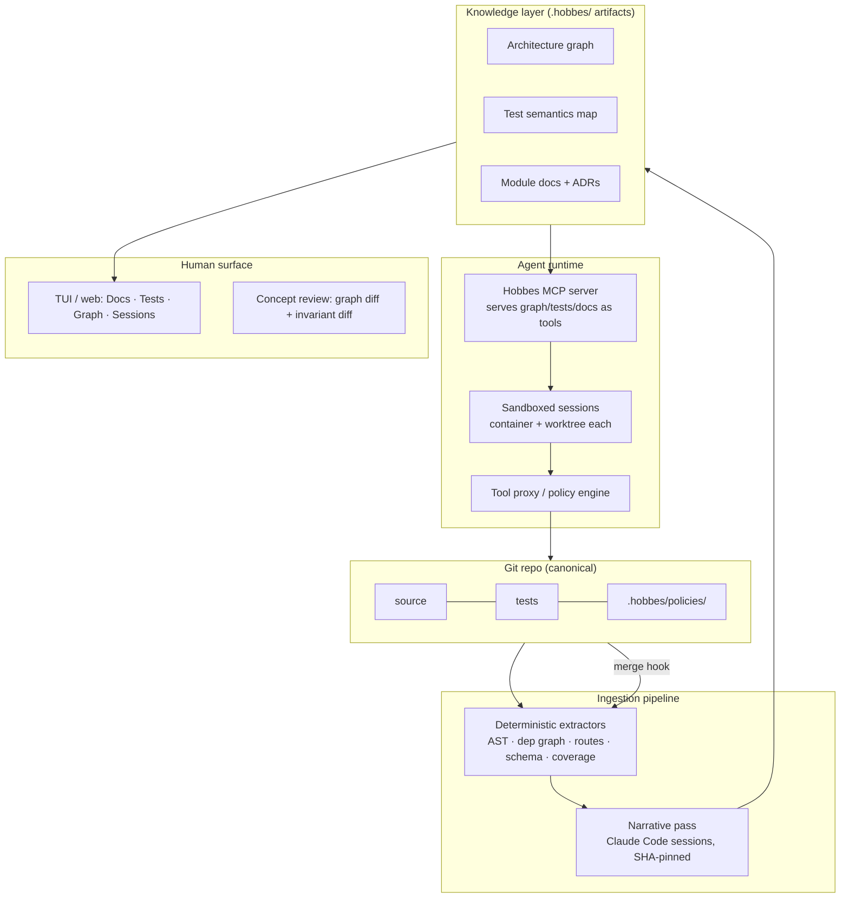

# Hobbes — Agentic Environment Architecture, v1.0

> **Historical — this is the frozen v1 record.** The running architecture is
> [`hobbes-architecture.md`](hobbes-architecture.md), which is the source of
> truth for build sessions and restates every subsystem so it stands alone
> (ADR-033). This document is kept because the *reasoning* behind the
> carried subsystems — policy, sandbox, escalation, flight recorder, quota,
> the human surface — is here and is still good, and because §3 is the
> record of the extraction design v2 replaced. It is not maintained. Where
> it disagrees with the running architecture, **the running architecture
> wins**.

**Hobbes** (after Calvin and Hobbes). First complete draft: every previously
open question is resolved with a recommended default, marked so they're easy to
overturn on review. Next step after sign-off: code decisions and a build plan.

A system that ingests a repo and produces a
policy-governed environment where agents do the line-level work and humans review
at the concept level: docs, test behavior, and architecture — not diffs.

---

## 1. Design principles

**P1 — The repo stays canonical; the environment is derived.**
Every doc, diagram, and test map is *generated from* the repo and pinned to a
commit SHA. Nothing in the environment is hand-maintained, because hand-maintained
views rot within weeks. If it can't be regenerated by rerunning the pipeline, it
doesn't belong in the environment layer.

**P2 — One knowledge layer, two renderers.**
The views a human needs for concept-level review (what does this module do, what
behavior is guarded by tests, what talks to what) are exactly the context agents
need to work well. Build the knowledge layer once; render it as a UI for humans
and as structured retrieval (MCP server) for agents. Never build "docs for people"
and "context for agents" as separate systems.

**P3 — Provenance on every generated claim.**
Any sentence an agent writes into the docs must cite `file:line @ SHA`. This makes
narrative verifiable, makes staleness detectable, and turns "is this doc right?"
into a mechanical check instead of a trust exercise.

**P4 — Policy is enforced below the model, not inside the prompt.**
Prompt-level rules ("don't run rm -rf") are advisory. Real enforcement lives in
the OS sandbox and a tool proxy. The model should be *unable* to violate policy,
not merely instructed not to.

**P5 — Deterministic first, generative second.**
AST parsing, dependency graphs, coverage traces, and route extraction are exact
and free. Agents only write the narrative layer on top of the deterministic
skeleton. This keeps quota burn low and hallucination surface small.

---

## 2. System overview



Everything below is one of five parts: **pipeline**, **knowledge layer**,
**policy/sandbox**, **agent runtime**, **human surface**.

---

## 3. Ingestion pipeline (your "orchestrator formats the repo")

### 3.1 Deterministic pass (no LLM, runs in seconds)
Per-language extractors produce a machine-readable skeleton:

- **Symbol + call graph** — tree-sitter AST walk; functions, classes, imports.
  Language notes: Python call graphs are approximate under dynamic dispatch —
  module-level edges stay reliable, and type hints sharpen symbol edges where
  present. For TS, resolve symbols through the compiler API (ts-morph) rather
  than tree-sitter alone. Route extraction reads FastAPI/Flask decorators and
  Express/Nest route registrations statically.
- **Module dependency graph** — package/folder-level edges, typed
  (`imports`, `http-call`, `queue`, `db-read/write`, `env-read`).
- **Interface inventory** — API routes, event topics, DB schema, CLI entry points.
- **Test inventory** — every test file, framework, and the symbols each test
  statically reaches (import + call chain).
- **Coverage trace** (optional, per CI run) — dynamic test→line mapping.
- **Infrastructure extractor (Terraform/HCL)** — HCL is declarative, so this is
  the highest-yield extractor per line of effort: parse with tree-sitter-hcl for
  modules/resources/variables, and consume `terraform show -json` /
  `terraform plan -json` when available for the fully-resolved resource DAG
  (`terraform graph` emits the dependency DAG for free). Yields infra topology,
  security-group/IAM edges, and blast-radius queries. Extractors read HCL and
  sanitized plan JSON only — **never `.tfstate`**, which carries secrets
  (denied at box.policy level).

Output: `.hobbes/graph.json`, `.hobbes/tests.json`, `.hobbes/interfaces.json`,
each stamped with the source SHA.

### 3.2 Narrative pass (Claude Code, subscription)
Agent sessions walk the skeleton — not the raw repo — and write:

- **Module docs**: purpose, responsibilities, key invariants, gotchas. One doc
  per node in the module graph.
- **Test behavior summaries**: one line per test describing the *behavior* it
  pins down ("rotating a refresh token invalidates the prior token"), grouped
  into a behavioral index per module.
- **System narrative**: data-flow walkthroughs for the top 3–5 user journeys.
- **Extracted invariants**: explicit statements the code appears to rely on
  ("only auth-core may mint tokens"), flagged `inferred` until you confirm them —
  confirmed invariants become the review checklist and future policy candidates.

Every claim carries `file:line @ SHA` provenance (P3).

### 3.3 Refresh loop
- Post-merge hook reruns extractors **incrementally** (graph diff tells you which
  nodes changed).
- Narrative regeneration is queued *only* for modules whose graph changed —
  this is what keeps subscription quota sane.
- Any artifact whose source SHA no longer matches is rendered with a **stale
  badge** in the UI. Staleness is visible, never silent.

---

## 4. Knowledge layer artifacts

### 4.1 Architecture graph
- Stored as typed JSON (nodes: modules/services/stores/external; typed edges).
- Rendered as **C4-style levels**: system context → containers → components,
  via Mermaid/D2 generated from the graph. Diagrams are never drawn by hand.
- **Cross-layer joins**: app-graph nodes link to infra-graph nodes
  (env var → RDS instance → security-group rules), so a diff can surface
  *"app now calls service X but no ingress rule permits it"* — a bug class
  invisible in either layer alone.
- **Graph diffs**: for any PR, compute `graph(base)` vs `graph(head)`. New or
  removed edges are the architectural change: *"this PR adds billing → auth-internal
  edge"* is a one-line review artifact worth more than 400 diff lines.

### 4.2 Test semantics map
Answers four questions the raw test suite can't:

1. **What behavior does this test guard?** (the one-line summary)
2. **What tests guard this file/module?** (inverse index)
3. **Which stated invariants have no guarding test?** → *behavioral coverage*,
   the metric that matters more than line coverage.
4. **Which tests are structurally weak?** (no assertions on the claimed behavior,
   over-mocked, tautological) — heuristic flags, not verdicts.

### 4.3 Docs
- Module docs + system narratives from §3.2, plus **ADRs** (decision records) that
  you write — the one hand-authored artifact class, because decisions aren't
  derivable from code. ADRs feed the invariant list.

---

## 5. Policy & sandbox layer

### 5.1 Policy scopes (your three levels)
Layered files, most-specific wins, **deny overrides allow**:

```
~/.hobbes/box.policy          # machine-wide floor (never allow: credential exfil,
                             # package publish, force-push to main, ...)
repo/.hobbes/repo.policy      # repo rules (allowed tools, egress allowlist,
                             # protected branches, migration commands gated)
repo/src/auth/.hobbes/folder.policy   # e.g. read-only for all agents; changes
                                     # here require human-flagged sessions
```

Policy entries cover: allowed tools, command patterns (allow/deny globs),
writable paths, network egress, resource caps, and **escalation** (commands that
aren't denied but require human confirmation — the middle tier you'd otherwise miss).

### 5.2 Enforcement tiers (outer beats inner)
1. **OS sandbox** — each session in a container (or bubblewrap) with: worktree
   mounted rw, prohibited paths not mounted or ro, network egress via allowlist
   proxy, resource limits. This is the tier that actually guarantees anything.
2. **Tool proxy** — agents get no raw shell. They call an MCP `exec` tool; the
   proxy matches the command against merged policy, executes or refuses (or
   escalates), and **logs everything** to a flight-recorder event log.
3. **Claude Code native permissions** (`settings.json` allow/deny rules) — inner
   convenience layer for UX, never the load-bearing one.

Secrets never enter the session environment: broker them per-command at the proxy
tier (this is exactly the ajax-manager pattern — it slots in as Hobbes's
credentials plane unchanged).

---

## 6. Agent runtime

- **Session = task**: spawned into a fresh git worktree + sandbox with the merged
  policy for its scope. Parallel sessions never share a working tree.
- **Context via MCP, not cold grep**: the Hobbes MCP server exposes tools like
  `get_module_doc(node)`, `who_calls(symbol)`, `tests_guarding(path)`,
  `graph_neighborhood(node)`, `list_invariants(scope)`. Agents start every task
  already oriented; this measurably cuts wasted turns and quota.
- **Roles as policy profiles, not personas**: an "implementer" session gets rw on
  its worktree; a "reviewer" session gets read-only mounts + the graph-diff tools;
  a "cartographer" session (narrative pass) gets read-only source + rw on
  `.hobbes/`. Same binary, different sandbox.
- **Flight recorder**: every tool call, refusal, and escalation appended to a
  per-session log. This is your audit trail and, later, your training/eval data.

---

## 7. Human surface

Four tabs, in the order you actually review:

1. **Graph** — current architecture; PR mode shows the *graph diff* first.
2. **Tests** — behavioral index; PR mode shows which guarded behaviors changed
   and which new code has no guarding behavior.
3. **Docs** — module docs with stale badges; PR mode shows narrative diffs.
4. **Diff** — the raw line diff, last, for when the first three raise a question.
5. **Sessions** — live agent monitor: status, current command, quota burn,
   escalations awaiting your confirmation.

Concept-review flow for a PR: *graph diff → invariant check → behavioral coverage
delta → (only if needed) line diff.* The environment's whole purpose is that
step 4 becomes rare.

Transport: a local web server on the dev box — nothing more in v1. Remote and
mobile access are deliberately out of scope; since the surface is plain HTTP,
any tunnel or proxy can be layered on later without touching the design.

---

## 8. Build order (subscription-only budget)

| Stage | What | Cost |
|---|---|---|
| 1 | Extractors → `graph.json` + Mermaid render (Python first, then TS/JS) | free, deterministic |
| 2 | Static test map + behavioral index scaffold | free |
| 3 | Narrative pass via Claude Code with SHA pinning + stale badges | subscription |
| 4 | Tool-proxy MCP server + container sandbox + 3-scope policy merge | free |
| 5 | Web/TUI viewer (Graph/Tests/Docs/Sessions) | free |
| 6 | Graph-diff PR review + escalation flow | free |
| 7 | Coverage-trace integration; multi-repo; invariant→policy compiler | later |

Stages 1–2 alone are already useful with zero agents involved. Stage 4 is where
it becomes an *agentic* environment rather than a docs generator.

---

## 9. Flagged items — v1 mechanisms

- **Staleness/drift** — unchanged: structural, via SHA pinning + incremental
  refresh + visible badges. No mechanism relies on discipline.
- **Narrative auditor** — a read-only session runs weekly and after any large
  merge. It samples ~5 claims per changed module and checks that each cited
  `file:line @ SHA` still supports the sentence. A disagreement marks the claim
  `disputed` and opens an issue; three disputes in one module queue full
  regeneration of that module's docs. Audit runs log to the flight recorder.
- **Escalation tier** — policy entries carry `decision: allow | deny | escalate`.
  An escalated command parks (the session continues other work or idles), pushes
  a card to the Sessions tab showing the exact command, the matched policy rule,
  and session context, and **expires to deny** after a timeout (default 30 min).
  Approvals log the approver and are replayable.
- **Quota budgeting** — per-session policy caps (`max_turns`,
  `max_wall_minutes`) plus a box-level reserve: the spawner refuses new sessions
  when the estimated remaining weekly window drops below the reserve. The
  Sessions tab shows per-session and rolling-window burn.
- **Flight recorder** — append-only JSONL per session:
  `{ts, session, role, tool, argv, policy_rule, decision, exit, sha}`.
  Audit trail and debugging record now; accumulated, it's the labeled dataset
  if the small-verifier idea is ever revisited with actual evidence.

---

## 10. Decisions (previously open — recommended defaults)

- **Graph granularity** — store symbol-level, render module-level, expand on
  demand. The graph file keeps both layers; the UI never opens at symbol level.
- **Where `.hobbes/` lives** — in-repo, split by reproducibility:

  ```
  .hobbes/
    policies/      versioned — hand-reviewed source of truth
    invariants/    versioned — confirmed invariants + ADRs
    derived/       gitignored — graph.json, tests.json, generated docs
  ```

  Derived artifacts are deterministic pipeline outputs: committing them adds
  merge noise without adding truth. Provenance lives in the SHA stamp, and CI
  rebuilds `derived/` per PR to compute graph diffs. Policies and invariants
  are hand-reviewed, so they version like source.
- **Invariant schema (v1)** — one YAML record per invariant:

  ```yaml
  id: I-3
  statement: only auth.core may mint or validate tokens
  scope: src/
  status: confirmed          # inferred | confirmed | retired
  compile:
    target: import-linter    # import-linter | dep-cruiser | semgrep | rego | soft
    rule: forbidden — anything except auth.core imports auth.token
  guarded_by: [test_token_boundary]
  ```

  `target: soft` means not mechanically checkable — the reviewer session
  evaluates it and must cite evidence. Everything else compiles into CI:
  **import-linter** contracts + semgrep for Python, **dependency-cruiser** +
  semgrep for TS/JS, Rego/Conftest against `terraform plan -json` for infra.
  (ArchUnit fills the same slot if a Java repo ever shows up — the compiler is
  per-language by design.) Cartographer-inferred invariants enter as `status: inferred` and
  are inert until you confirm them.

---

## 11. Explicitly out of scope for v1

Multi-repo; coverage-trace integration (static test mapping only); remote or
mobile access; compile targets beyond the three above; fine-tuned local models;
IDE plugins.

**The v1 bar:** ingest one of your real Python repos (plus its Terraform, if it
has any) and one TS/JS repo, serve the four tabs, run one implementer and one
reviewer session under policy, and produce a graph-diff review for one real PR.
Dogfooding on your own repos is deliberate: you can only judge whether the
derived layer is *true* on code whose ground truth lives in your head.
