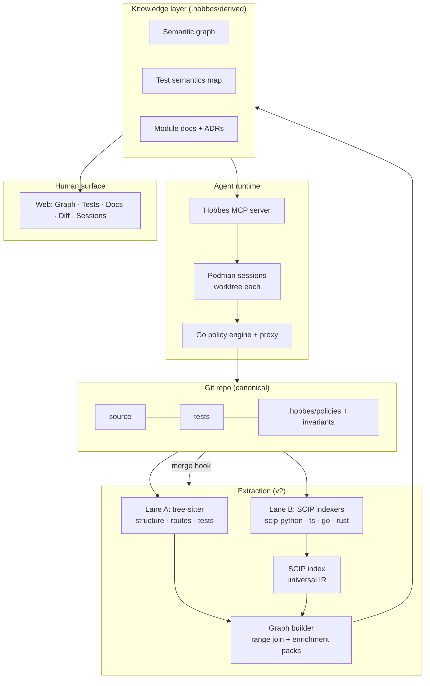

# Hobbes — Architecture v2

**Status:** supersedes v1's extraction layer; every other v1 subsystem carries
forward and is restated here so this document is self-contained. The v1 base
(build-plan milestones M0–M8) is built and running. This file is the
source-of-truth context for build sessions: read it fully, alongside CLAUDE.md
and the last two BUILDLOG entries, before writing code. Deviations require an
ADR and a patch to this document in the same commit.

**What v2 changes:** extraction becomes two parallel lanes (syntax + semantics)
merged over a universal IR, languages become configuration instead of
integrations, edges carry confidence tiers, and invariants move toward a single
checker over the graph.

---

## 1. Design principles

- **P1 — The repo stays canonical; the environment is derived.** Everything in
  `.hobbes/derived/` is regenerable from a commit SHA. Nothing derived is
  hand-maintained.
- **P2 — One knowledge layer, two renderers.** The same artifacts serve the
  human UI and the agent MCP tools. Never build docs-for-humans and
  context-for-agents separately.
- **P3 — Provenance on every generated claim.** Narrative statements cite
  `file:line @ SHA`. Graph edges cite their source lane and evidence.
- **P4 — Policy is enforced below the model.** OS sandbox and tool proxy are
  load-bearing; prompt-level rules are advisory.
- **P5 — Deterministic first, generative second.** Parsers and indexers build
  the skeleton; agent sessions only write narrative on top of it.
- **P6 — Degrade visibly, never silently.** (new) When a semantic indexer
  fails — broken build, unwired language — the graph still exists at syntactic
  confidence and says so. Staleness gets badges; uncertainty gets tiers.
- **P7 — Languages are configuration, not integrations.** (new) Adding a
  language means an indexer config entry plus an optional enrichment pack.
  If it requires touching the graph builder's core, the design has failed.

---

## 2. System overview



---

## 3. Extraction layer (v2)

### 3.1 Lane A — syntax (tree-sitter)
Fast, incremental, error-tolerant; runs on every commit and works on code that
doesn't compile. Produces: file/module structure and folder topology,
framework-declared interfaces readable syntactically (FastAPI/Flask decorators,
Express/Nest registrations), test inventory and structure, and *approximate*
module-level dependency edges.

**Lane A no longer *resolves* symbols; it still *detects* syntax (ADR-029).**
An earlier wording said resolution "moves entirely to lane B", which assumed
lane B could answer everything lane A could. It cannot answer *is this a
call*: SCIP occurrences carry a `syntax_kind` that would say so, and
scip-python populates it for none of them. So lane A owns call-site
detection, lane B owns resolution, and the answer that matters — a call
pointing where it actually goes — comes from joining them (§3.4).

### 3.2 Lane B — semantics (SCIP indexers)
Per-language batch indexers emitting SCIP, the universal IR: `scip-python`
(built on Pyright), `scip-typescript`, `scip-go`, and rust-analyzer's native
`scip` output when Rust arrives. Hobbes writes no provider adapters — it runs
indexers and consumes their output. Precise symbols, definitions, references,
and cross-file edges. Slower than lane A; cached (§3.6).

The lanes are **parallel sources, not sequential stages**: semantic providers
parse independently and never consume tree-sitter ASTs.

### 3.3 Universal IR and node identity
SCIP symbol monikers are globally unique (they encode package and version) and
become the **graph's node IDs**. Consequences: node identity is stable across
re-indexes, and future multi-repo support is a graph merge, not a schema
migration. Lane-A-only nodes (modules in languages with no indexer yet) get
deterministic path-based IDs in a distinct namespace, upgraded in place when an
indexer lands.

**Stability is a decision, not a property (ADR-027).** The version field in a
moniker defaults to the git revision, so left alone every node id changes on
every commit. Hobbes always pins `--project-version` to a constant; the price
is that monikers carry no real version, so a future multi-repo merge keys on
package identity alone. Monikers also become node ids only *after* descriptor
filtering — roughly 86% of SCIP definitions are parameters, locals and meta
symbols the graph does not want.

### 3.4 Graph builder
Joins the lanes on file:line ranges — SCIP occurrences carry ranges, lane A
structures carry ranges — **before the graph is built**, through two IRs
(ADR-029): providers emit range-anchored observations into an *evidence IR*,
the join resolves them into a *semantic IR*, and the builder projects that
onto ids without resolving anything itself. Joining finished edges instead
cannot produce an edge that is a call *because* tree-sitter saw one and
points where it does *because* SCIP resolved it — that edge belongs to
neither lane alone. Every edge records:

- `type` — imports | call | http-call | db-read | db-write | queue | env-read |
  infra edge types from the Terraform pack
- `tier` — `semantic` (SCIP-proven) | `syntactic` (lane A) | `dynamic`
  (reserved for coverage traces; schema present, ingestion out of scope)
- `evidence` — file:line ranges + producing lane/pack

**Lane-agreement self-test:** wherever both lanes can produce the same
module-level edge, they must agree. Disagreements are emitted as a CI report —
a free extractor-bug detector. Consumers treat tier as trust: an invariant
violation proven on semantic edges is a finding; on syntactic edges it's a
suspicion, and the reviewer flow says which.

### 3.5 Enrichment packs
SCIP supplies symbols and references — not typed architectural edges. Packs are
a plugin surface symmetric with indexers: framework-aware passes that promote
raw edges to typed ones (`http-call`, `db-read`, `queue`, `env-read`) and add
domain joins. The Terraform cross-layer join (env var → resource →
security-group rule) is a pack. v1's framework knowledge (FastAPI/Flask,
Express/Nest) refactors into packs. Packs declare which tier their edges carry.

### 3.6 Incrementality
Caching, not cleverness: partial SCIP indexes cached by content hash and
merged; lane B runs debounced locally and per-PR in CI; lane A remains the
every-commit fast path. Full re-index is always available and always correct
(`P1`), the cache only makes it cheap.

### 3.7 Adding a language — the checklist
1. Add the indexer to `hobbes.yaml` (command, version pin, cache key rule).
2. Optional: enrichment pack(s) for its frameworks.
3. Optional: lane A grammar for structure/routes/tests if richer syntax
   passes are wanted.
Nothing else. Rust is the intended proof: rust-analyzer's SCIP output plus
zero new builder code.

---

## 4. Knowledge layer

- **Semantic graph** — nodes keyed by SCIP moniker; typed, tiered edges;
  rendered as C4-style levels (symbol-level stored, module-level rendered,
  expand on demand — Cytoscape.js in the web surface, Mermaid for exports).
  **Graph diffs** stay the review primitive and are now tier-aware: a PR's
  architecture delta distinguishes proven new edges from suspected ones.
- **Test semantics map** — behavioral one-liners per test, forward and inverse
  test↔code indexes (now via monikers), behavioral coverage vs stated
  invariants, weak-test heuristics. Unchanged in purpose.
- **Docs** — SHA-pinned module docs and system narratives written by
  cartographer sessions over the deterministic skeleton; ADRs remain the one
  hand-authored class. Stale badges on SHA drift; the periodic auditor session
  spot-checks claims against cited lines.

---

## 5. Invariants

Constrained YAML schema, one record per invariant, unchanged in shape but with
a new checking mode:

```yaml
id: I-3
statement: only auth.core may mint or validate tokens
scope: src/
status: confirmed            # inferred | confirmed | retired
check: graph                 # graph | emit | soft
compile:                     # only when check: emit
  target: import-linter      # import-linter | dep-cruiser | semgrep | rego
  rule: forbidden — anything except auth.core imports auth.token
guarded_by: [test_token_boundary]
```

- `check: graph` — the **unified checker** evaluates the invariant directly
  against the semantic graph, using semantic-tier edges as proof and flagging
  syntactic-tier matches as suspicions. This is the v2 direction: one checker,
  every language, no per-language fragmentation.
- `check: emit` — compile to per-language tools (import-linter,
  dependency-cruiser, semgrep; Rego/Conftest against `terraform plan -json`).
  Retained as the CI-compatibility escape hatch and for teams' existing
  toolchains.
- `check: soft` — reviewer session evaluates and must cite evidence.

---

## 6. Carried subsystems (v1, condensed)

- **Policy engine (Go, single implementation)** — box → repo → folder merge,
  deny-overrides-allow, `allow | deny | escalate`; used by CLI and daemon.
- **Sandbox** — Podman rootless, image per role (implementer rw-worktree;
  reviewer read-only; cartographer read-source + rw-derived); policy paths map
  to mounts, network policy to container config. Secrets brokered per-command
  at the proxy (ajax-manager pattern); never in session env. `.tfstate` denied
  at box level; `derived/` never committed.
- **Escalation** — parked sessions, Sessions-tab cards, expire-to-deny
  (default 30 min), logged approvals.
- **Flight recorder** — append-only JSONL per session:
  `{ts, session, role, tool, argv, policy_rule, decision, exit, sha}`.
- **Quota** — per-session caps plus box-level reserve gating the spawner.
- **Human surface** — Graph · Tests · Docs · Diff · Sessions; concept-review
  flow: graph diff → invariant verdicts → behavioral coverage delta → line
  diff last. v2 UI additions: edge styling by tier and the lane-disagreement
  report view.

Rejected alternatives, for the record: live LSP querying (stateful, slow for
whole-repo batch; may return later for UI hover only), stack graphs (thin
language coverage), Kythe (operationally heavy). SCIP indexers are the
maintained middle.

---

## 7. v2 build plan

Language mapping unchanged: Python for pipeline and packs, Go for
engine/proxy/supervisor, TS for web. Estimates in evenings.

### V2.M0 — Spike: real SCIP before the schema freezes (1) — **done**
Run the indexers on the four sanctioned repos and decide, on evidence, what
monikers can and cannot be relied on for. *Exit: ADR-027, and a go/no-go on
monikers-as-node-ids.* **Verdict: go, with three conditions** — a pinned
`--project-version` (the default embeds the git revision, so ids would
otherwise change on every commit), per-repo indexer config (a src-layout
Python repo silently loses every test→source edge without it), and
descriptor filtering (only ~14% of SCIP definitions are graph-worthy).

### V2.M1 — Graph schema v4 and the version gate (3–4)
Moniker-keyed nodes **under ADR-027's pinning rule**, tiered/evidenced edges,
lane-A namespace, versioned JSON contract with a migration shim so v1
consumers (web, knowledge tools, invariant emitters) keep working. `tests.json`
is part of the contract: its `symbol` and `reaches` fields are symbol ids.
Schema **v4**, not v2 — the artifact schema is already at v3. Includes the
version gate ADR-006 promises and no consumer implements, without which the
shim has nothing to hang on. *Exit: v1 graph regenerates under v4; web renders
it unchanged; every consumer refuses a version it does not know.*

### V2.M2 — Lane B: SCIP integration (4–5)
Run scip-python and scip-typescript; content-hash cache + merge; SCIP → graph
adapter. **Carries the indexer-config registry**, moved here from M4 by
ADR-027: lane B cannot land usefully without it, and a misconfigured indexer
degrades silently. *Exit: on your dogfood repos, symbol edges from SCIP replace
lane-A guesses; spot-check 20 semantic edges — the bar is now correctness of
the join, target ≥95%.* Surface `tier` in the UI here, so the first
human-visible v2 improvement does not wait for M6.

### V2.M3 — Lane A refactor + self-test (2–3)
Strip symbol resolution from the v1 extractors; lane A keeps structure, routes,
tests. **Test reach moves to lane B in this milestone** — `collect_tests`
consumes lane A's symbol edges today, so stripping them regresses `tests.json`
otherwise. Implement the lane-agreement report as a CI check *and* a command.
*Exit: disagreement report runs clean on the dogfood repos or every
disagreement is an explained, filed bug.*

### V2.M4 — Enrichment packs (3–4)
Pack interface + registry in `hobbes.yaml` (**own ADR first** — a repo-level
registry is in tension with ADR-012's "all of `.hobbes/` is personal"); port
FastAPI/Flask, Express/Nest, and the Terraform join into packs; packs declare
edge tier. *Exit: deleting a pack cleanly removes exactly its edges; adding it
back restores them.*

### V2.M5 — Go language support (2–3)
scip-go config + a small Go enrichment pack (net/http or chi routes). First
real test of P7. *Exit: a Go repo ingests with zero builder changes; checklist
§3.7 was literally sufficient.*

### V2.M6 — Unified invariant checker (4–6)
`check: graph` evaluation engine over the semantic graph with tier-aware
verdicts (proven vs suspected); reviewer flow and `hobbes review` consume it;
`check: emit` path retained and tested. *Exit: I-series invariants for one
dogfood repo run under `check: graph` and agree with the emitted-tool verdicts
where both exist.*

### V2.M7 — Rust proof (1–2)
rust-analyzer `scip` output on any Rust repo. *Exit: ingestion with zero new
builder code — P7 demonstrated on a language nobody planned for.*

**Total: ~20–28 evenings** (M0 adds one, M1's widened scope adds one).
`docs/hobbes-build-plan-v2.md` holds the file-level breakdown and the
reasoning behind the deviations folded in above. Sequencing rules carry from
v1: deterministic
before generative, each milestone exits on a real repo, one milestone active
at a time, stop at exits for human review.

---

## 8. Using this document in build sessions

Session context = this file + CLAUDE.md + the last two BUILDLOG entries.
Standing discipline is unchanged: plan file-by-file before implementing; ADR
for every decision this document doesn't make, patched into this document in
the same commit when it changes the architecture; BUILDLOG entry and CLAUDE.md
status update every session; tests with code; conventional commits; never read
`.tfstate`, never commit `derived/`. Milestone exits stop and hand the wheel
to the human — spot-checks and walkthroughs are theirs to run. In the kickoff
and milestone prompts, this file replaces the v1 architecture and build-plan
docs as source of truth.

## 9. Out of scope for v2

Multi-repo graphs (monikers prepare it; not built); dynamic-tier ingestion
(schema only); live LSP for UI; languages beyond Python/TS/Go plus the Rust
proof; IDE plugins; any model fine-tuning.
