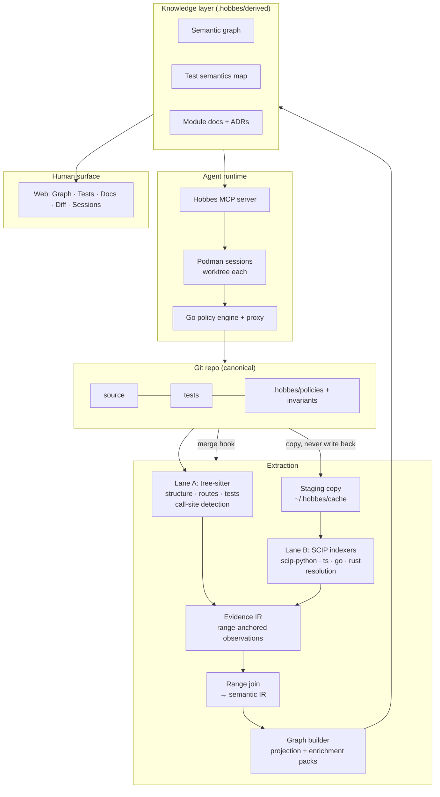

# Hobbes — Architecture

**This is the running architecture** (ADR-033). It describes Hobbes as it is
now, not as of a version, and it carries no version number for that reason.
When the design moves, this file moves with it *in the same commit* — the
rule is in §9 and it is what keeps the file true. It is the source-of-truth
context for build sessions: read it fully, alongside CLAUDE.md and the last
two BUILDLOG entries, before writing code.

The frozen record of where Hobbes started is
[`hobbes-architecture-v1.md`](hobbes-architecture-v1.md), and `docs/adr/` is
the dated account of every change since. Where either disagrees with this
file, **this file wins**.

*(Why running instead of versioned: v1 shipped M0–M8, then the "v2"
extraction rewrite was written down as its own document — and the design
moved out from under it within three milestones. The evidence IR of ADR-029
is not the shape v2 described, and the demotion of ADR-031 reverses an
instruction v2 gave in plain words. A versioned architecture doc is stale
the day after the next decision. One running file, amended in place, cannot
drift without someone noticing.)*

---

## What Hobbes is

**A multilingual, deterministic code graphing environment.** It ingests a
repo and derives from it a policy-governed environment where agents do
line-level work and humans review at the concept level.

Three properties carry the whole design, in this order of precedence:

- **Accurate.** This is the job. Everything else here is a means to it. A
  graph that is wrong is worse than no graph, because it is *believed* —
  and it is believed by an agent that cannot check it.
- **Deterministic.** The skeleton is built by parsers and indexers, never by
  a model. Same commit in, same artifacts out. Generative work sits on top
  of the deterministic layer and is pinned to it (P5); it is never mixed
  into it.
- **Honest.** Determinism only promises the same answer twice — not a true
  one. So Hobbes reaches the truth it can and then *states the shape of what
  it missed*: a tier on every edge (P6), a registered constraint for every
  concession (P8), and its providers' limits owned as its own (P9).

**Abstraction is the product; accuracy is the precondition.** Hobbes exists
so a human can stop reading diffs and start reading architecture. That trade
is only worth making if the abstraction is true — a confident summary
standing on a graph that quietly guessed costs more than the diff it
replaced.

### Where this is going

The graph is not the goal. The goal is **single-use agents under derived,
systematic context.**

A model's accuracy degrades as context grows and as tasks pile up in one
session. The answer is not a larger window; it is a smaller job. Hobbes
knows the repo's real structure, so it can derive — per task — the context
that task actually needs and the policy that task is actually permitted,
start one agent inside both, and let the agent end when the task does.
Context is then *scoped by the architecture* rather than assembled by a
prompt, and regenerated rather than accumulated.

This is what the sandbox and the policy engine are for, and why they sit
below the model rather than inside it (P4). A rule in a prompt is a request.
A command outside the policy is not refused — it is **absent**: no binary on
the path, no mount to write through, no route to the network. *If an agent
cannot execute a command in a space where it literally cannot, then it
literally cannot.* Enforcement that depends on the model's cooperation is
not enforcement.

**The guaranteed fraction is the product.** A model handed a repo raw has
a **0% guarantee** of assembling accurate systematic context — it often
does well, and nothing bounds when it does not. Hobbes's job, stated as
insurance rather than omniscience: convert some fraction of the codespace
from *left to model interpretation* into *derived, checked, and citable* —
and the integrity of that fraction matters more than its size. If Hobbes
can confidently capture 20% of a repo, then that 20% must be properly and
effectively captured: every edge tiered, every concession registered,
nothing inflated (the register's floor property — no remaining limit
inflates a number). A small guaranteed fraction is not a small result,
twice over. First, it moves the guarantee from zero to a real number, and
the sandbox hardens the same move on the action side — a forbidden command
is absent, not refused — so both what an agent must be trusted to *know*
and what it must be trusted to *not do* shrink together. Second, the
complement is itself information: what Hobbes cannot reliably capture is
thereby **identified** — the dynamic, unique, or special parts of the
repo, pointed at as needing care rather than papered over. The register
(P8) is what keeps the boundary between the two honest.

Three of the four pieces existed first. The graph makes the derivation
possible (§3), invariants make the result checkable (§5), and the policy
engine and sandbox already make it enforceable (§7). **The fourth is
begun (ADR-051):** the *mapping* half of the derivation — proposal to
change-spec, with per-agent context and policy manifests — is running
code (§6, `hobbes plan`). The *execution* half — spawning the per-unit
sessions those manifests describe, serving context faults, recording
partition quality — is built as a base (§6.1, ADR-054), and the benchmark
harness that will correct it from its errors is built and unrun (§6.2,
ADR-055). The design the mapping implements is
[`agent-mapping.md`](agent-mapping.md): **phases, not personas** — an
agent is a triple *(context slice, policy profile, verification
obligations)*, and the number of agents is the partition's output, never
a parameter.

**Verification is a benchmark harness (ADR-052).** The derivation's
claims about itself are falsifiable, and the plan is to falsify them:
run Hobbes as a harness under known benchmarks (instance in → ingest →
plan → per-unit execution → verify → patch out) against the same
models run pure, and let the error stream drive the adjustment — every
failed instance feeds exactly the numbers C-35 calls guesses. Three
hypotheses are preregistered in
[`benchmark-hypotheses.md`](benchmark-hypotheses.md), each with its
metric and falsifier stated before any run: **H1** derived context
substitutes for model size; **H2** per-unit regenerated context
flattens the accuracy-vs-depth curve; **H3** cheaper and quicker per
solved task, as a byproduct. The harness is built (`hobbes bench`,
§6.2, ADR-055) and quota-free to exercise; **no live run has
happened** — the first one waits on the owner's decisions about a
session image that can run the model (§6.2), and the point of writing
the hypotheses first is that results cannot re-scope them.

**The derivation contract (ADR-047).** When per-task derivation is built,
derived context has two mandatory halves: the captured fraction — graph,
tests, docs, everything citable — and the **stated complement**: what
Hobbes cannot see in the task's scope, drawn from the constraint register
and the per-repo tail view, in the form `list_blind_spots` already serves
to agents today. Knowing what cannot be seen is how an agent points at
the work it must do itself — the context to gather by reading, the claims
to verify rather than trust — so a derivation that hands an agent only
the known half has recreated the confident-surface-over-quiet-gap failure
(P8) at the exact layer built to prevent it. Derived **policy** meets the
same data from the enforcement side: where the graph cannot see, there is
less evidence to widen permissions on, and staying narrow — or
escalating — is the honest default. These are requirements the built
mapping now enforces in code, not aspirations: a change-spec refuses to
serialize a context manifest without its stated complement, and a
blind-spot-heavy unit gets a narrower sandbox and a human-first flag
(§6). A derivation that does not carry the complement is not done.

**Local, deliberately.** Hobbes runs on the box, against a repo on disk. It
is not a hosted product, an application to log into, or an IDE plugin (§10).

---

## 1. Design principles

- **P1 — The repo stays canonical; the environment is derived.** Everything in
  `.hobbes/derived/` is regenerable from a commit SHA. Nothing derived is
  hand-maintained.
- **P2 — One knowledge layer, two renderers.** The same artifacts serve the
  human UI and the agent MCP tools. Never build docs-for-humans and
  context-for-agents separately.
- **P3 — Provenance on every generated claim.** Narrative statements cite
  `file:line @ SHA`. Graph edges cite their source lane and evidence.
- **P4 — Policy is enforced below the model.** OS sandbox and tool proxy are
  load-bearing; prompt-level rules are advisory.
- **P5 — Deterministic first, generative second.** Parsers and indexers build
  the skeleton; agent sessions only write narrative on top of it.
- **P6 — Degrade visibly, never silently.** When a semantic indexer
  fails — broken build, unwired language — the graph still exists at syntactic
  confidence and says so. Staleness gets badges; uncertainty gets tiers.
- **P7 — Languages are configuration, not integrations.** Adding a
  language means an indexer config entry plus an optional enrichment pack.
  If it requires touching the graph builder's core, the design has failed.
- **P8 — Every concession is a registered constraint.** When Hobbes
  cannot recover information — a limit of static analysis, a deliberate
  filter, a deferred sharpening — the gap is entered in
  `docs/constraints.md` together with the place a user meets it. P6 covers
  the run that failed; P8 covers what was never knowable. A constraint
  whose only surfacing is a document is recorded as *unsurfaced*, because
  a confident artifact concealing a known gap costs more trust than one
  that fails loudly (ADR-030).
- **P9 — A provider's limits are Hobbes's limits.** Semantics come from
  third-party, language-specific indexers that Hobbes runs and does not
  wrap (§3.2). Every gap one of them has *against us* is written down and
  surfaced as **ours** — never disowned as the indexer's problem, never
  left as a silent hole in the graph. The user is not running
  `scip-python`; they are running Hobbes, and a missing edge is
  indistinguishable from an absent call either way (C-1). A provider limit
  registers exactly like any other concession under P8 and additionally
  names the provider and version that produced it, because its lifetime is
  the provider's rather than ours: C-6, C-9 and C-23 are all provider
  limits, and any of them may end on an upstream release (ADR-034).
- **P10 — A specific safety guarantee outranks a general safety system.**
  A general mechanism — degrade-on-failure, catch-and-continue,
  escalate-by-default, expire-to-deny — is a policy about the *unknown*
  case. A specific guarantee (never read `.tfstate`, never push) is a
  decision about a *known* one. Where they meet the specific one wins, and
  the general mechanism must be written so it **cannot** absorb it: it names
  what it will not handle and re-raises that first. Rank by importance ×
  coverage — the broader a mechanism's reach, the less it may decide on its
  own. Intent is not enough, because whoever widens the general mechanism is
  usually not thinking about the specific one: V2.M4's `except Exception`
  around packs swallowed the refusal guarding I-1 and turned a refused
  ingest into a successful one (ADR-036).
- **P11 — A coverage claim is scoped to its evidence.** "Hobbes supports
  language X" is shorthand for an enumerable fact — the machinery ran
  end-to-end on the repos in §3.8 and the stated checks passed *there* —
  and it licenses nothing beyond that sample. Verification on one small
  repo proves the **machinery**, not the **language**: 33 hand-checked
  call edges make "Rust ingestion works and is honest about its tiers" a
  true claim and "Hobbes covers Rust" a false one, and the false one is
  the confident-surface-over-known-gap shape P8 exists to prevent. So a
  statement of support names its sample; extending the claim means
  extending §3.8's table in the same commit as the evidence; and where
  languages are listed as peers, the asymmetry of their evidence bases is
  stated too. The register carries the residual risk as C-31 (ADR-044).

---

## 2. System overview



---

## 3. Extraction layer

### 3.1 Lane A — syntax (tree-sitter)
Fast, incremental, error-tolerant; runs on every commit and works on code that
doesn't compile. Produces: file/module structure and folder topology,
framework-declared interfaces readable syntactically (FastAPI/Flask decorators,
Express/Nest registrations), test inventory and structure, and *approximate*
module-level dependency edges.

Five providers: `pysource` (Python), `tssource` (TS/JS, via the ts-morph
helper), `gosource` (Go, V2.M5), `rustsource` (Rust, V2.M7), and the HCL
walk inside the Terraform pack. Each answers the same question — where are
the call sites, and what encloses them — and none of them resolves anything.

Two things Go made explicit that the others had not (ADR-037). **A type
conversion is spelled exactly like a call**: `Decision(s)` and `Resolve(s)`
are the same node, and no indexer separates them either, so lane A drops
conversions using the one thing it knows and SCIP does not — which names
are types. And **a Go import names a package, not a file**, so lane A emits
no in-repo import edges for Go at all; the join raises them from what the
call actually reaches, which is precise instead of a guess between a
package's files.

Rust inherits the import rule (a `use` names an item path; `ext:` edges
only, the join raises the rest) and adds one of its own (ADR-040):
**macro arguments are unparsed token trees** to tree-sitter, and nearly
every Rust test asserts through a macro, so `rustsource` applies
call-shape detection inside token trees — an identifier immediately
followed by a parenthesized token tree is a call site at that identifier.
A false-shaped site produces no edge, because nothing resolves at it;
rust-analyzer meanwhile emits macro-argument occurrences at their real
pre-expansion positions, so the two lanes still meet on ranges.

**Lane A no longer *resolves* symbols; it still *detects* syntax (ADR-029).**
An earlier wording said resolution "moves entirely to lane B", which assumed
lane B could answer everything lane A could. It cannot answer *is this a
call*: SCIP occurrences carry a `syntax_kind` that would say so, and
scip-python populates it for none of them. So lane A owns call-site
detection, lane B owns resolution, and the answer that matters — a call
pointing where it actually goes — comes from joining them (§3.4).

**Lane A's resolver is demoted, not deleted (ADR-031).** It stops producing
edges and becomes the join's *fallback*, consulted only where the semantic
provider resolved nothing and stamped `syntactic` when it is. There is one
resolver of record and it is lane B; what remains beneath it is a labelled
floor, not a second opinion. Without it, a repo whose language has no
indexer — or a box without one installed — would hold no call graph at all,
which P6 forbids and P7 would make permanent. The cost is registered as
constraint **C-8**.

### 3.2 Lane B — semantics (SCIP indexers)
Per-language batch indexers emitting SCIP, the universal IR: `scip-python`
(built on Pyright), `scip-typescript`, `scip-go`, and rust-analyzer's native
`scip` export (V2.M7, ADR-040). Hobbes writes no provider adapters — it runs
indexers and consumes their output. Precise symbols, definitions, references,
and cross-file edges. Slower than lane A; cached (§3.6).

The lanes are **parallel sources, not sequential stages**: semantic providers
parse independently and never consume tree-sitter ASTs.

**Running someone else's indexer is a trade, and P9 is the price.** Hobbes
gets real name resolution for a language it never has to understand, and in
exchange it inherits that indexer's blind spots and owns them in public. The
inherited limits so far are registered as C-6 (SCIP cannot say what a
reference syntactically *was*), C-9 (only five descriptor kinds become graph
symbols), C-23 (TypeScript semantics need the target repo's dependency
tree installed), C-28 (a symbol two cargo targets both define is
unattributed rather than guessed), C-29 (indexing a Rust repo executes
its build scripts and proc macros — the one provider that runs
repo-authored code, disclosed at every ingest), and C-30 (Rust
third-party resolution needs a fetchable crate registry). Each names its
provider and version, because unlike our own concessions these can end
on an upstream release.

**Lane B runs per unit and degrades per unit** (ADR-048). The unit an
indexer's loader understands — a tsconfig zone, a Go module, a cargo
workspace — is the unit Hobbes indexes, and since the dagger session it
is also the unit that fails: one broken unit records its own degradation
(naming the unit, the error, and that the others are unaffected) and the
rest of the language keeps its semantics. Before that, one docs zone
missing a devDependency zeroed all 84 of dagger's TypeScript zones — a
visible but wrong-sized degradation, which P6 does not actually permit.

**Units meet again in the cross-unit moniker join** (ADR-049, lifting
C-33). A decoded index calls a reference "external" when *that index*
does not define it — but a sibling unit of the same repo may define
exactly that moniker, so external rows keep their monikers (helper
facts v3) and `join_cross_unit` promotes them to ordinary references on
**exact moniker equality** after a language's units merge. Go replace
targets are staged beside their consumers so the loader can type the
import in the first place (the consumer's own go.mod, path
replacements, in-repo only). This is not the cross-zone reconciliation
C-12 rejected: nothing interprets another unit's compiler
configuration — a moniker matches byte-for-byte or the reference stays
external, and a moniker two units both define abstains, reported
(C-28's rule across units). Proven on the fixture that reproduced
C-33 (0% → 100%, edge `semantic`) and on dagger; the lifted entry
carries the residual edge cases.

**Lane B never writes to the target repo.** Indexers want to run inside the
tree they index, so Hobbes stages a copy under `~/.hobbes/cache` and runs
them there (ADR-027's seven-clause contract). Authored source is copied;
a regenerable dependency tree is *symlinked*, because copy-preserving it
measured a 6.4% loss of semantic references (ADR-032). Two properties of
that link are asserted by test rather than assumed: indexing writes nothing
through it, and teardown unlinks it instead of recursing into the target
(C-22). The second is the mistake that would delete a user's `node_modules`.

Since ADR-050 the stage's dependency view is the repo's, or better —
still without writing a byte into it. **Every** `node_modules` on a
zone file's walk-up path is linked at its repo-relative position
(resolution walks up from the *file*, and a zone can span several
package directories — linking only the zone root's tree left this
repo's own `tsextract/` dependencies behind); and when the repo has no
tree at all but carries a lockfile Hobbes can honor
(`package-lock.json`, v1 `yarn.lock`), one is **provisioned into
Hobbes's cache** — lockfile-pinned or declined (P1), always
`--ignore-scripts` — and linked in the same way. The boundary (pnpm,
Berry, lockfile-less, offline) is C-34, declined by name per zone;
C-23 survives narrowed as the answer there.

### 3.3 Universal IR and node identity
SCIP is the universal IR every semantic provider emits, and SCIP symbol
monikers are globally unique. **They are not, however, the graph's node
IDs** — a correction to the plan, and the range join is why.

The plan was moniker-keyed nodes, with lane-A-only modules held in a
separate `scip:`-free namespace and upgraded in place once an indexer
landed. What shipped instead: **node ids remain lane A's deterministic
path-based ids** (`hobbes.extract.graph`, `driver.Proxy`, `env:HOME`,
`ext:react`), and monikers stay *inside* lane B as the key it resolves
against. Because the lanes meet on file:line ranges rather than on ids
(§3.4), lane B never has to invent an id for anything lane A already named,
so node identity does not churn when an indexer is added, removed, or
upgraded — which was the actual goal. The `scip:` namespace ADR-028
reserved for ids lane B would have to invent exists and is unused.

Consequences, stated honestly because the plan claimed more:

- **Stability is a decision, not a property (ADR-027).** A moniker's version
  field defaults to the git revision, so left alone every symbol re-keys on
  every commit — which would make `hobbes diff` report the whole repo as
  removed-and-re-added. `--project-version` is always pinned to a constant.
  The price is that monikers carry no real version (**C-10**).
- **Monikers reach the join only after descriptor filtering** — roughly 86%
  of SCIP definitions are parameters, locals and meta symbols the graph does
  not want (**C-9**).
- **Multi-repo merge is less prepared than v2 assumed.** The claim was that
  moniker-keyed nodes make a merge a graph union rather than a migration.
  With path-based ids that no longer follows: two repos can both hold
  `src/util`, and the merge would need a repo-scoping pass the current ids
  do not have. Nothing is lost that was ever built — but §10's "monikers
  prepare it" is weaker than it reads, and this is the note that says so.

### 3.4 Graph builder
Joins the lanes on file:line ranges — SCIP occurrences carry ranges, lane A
structures carry ranges — **before the graph is built**, through two IRs
(ADR-029): providers emit range-anchored observations into an *evidence IR*,
the join resolves them into a *semantic IR*, and the builder projects that
onto ids without resolving anything itself. Joining finished edges instead
cannot produce an edge that is a call *because* tree-sitter saw one and
points where it does *because* SCIP resolved it — that edge belongs to
neither lane alone. Every edge records:

- `type` — imports | call | http-call | db-read | db-write | queue | env-read |
  infra edge types from the Terraform pack
- `tier` — `semantic` (SCIP-proven) | `syntactic` (lane A) | `dynamic`
  (reserved for coverage traces; schema present, ingestion out of scope)
- `evidence` — file:line ranges + producing lane/pack

**The join is the only producer of symbol edges** — for every language, and
it runs *whether or not lane B does*. With no semantic input, every call
site falls to the fallback arm (§3.1) and the graph is stamped `syntactic`
throughout. There is deliberately **no second code path** for the degraded
case, so P6 holds by construction rather than by a branch nobody exercises;
the test suite runs with lane B disabled by default, which means the
degraded path is the one under test on every run.

**Lane-agreement self-test:** wherever both lanes can produce the same
module-level edge they must agree, and — sharper — wherever both resolved
the same call *site*, they must resolve it to the same place. It is a CI
check and a command (`hobbes lanes`, exit 1 on disagreement), which makes it
a free extractor-bug detector rather than a report nobody opens. Consumers
treat tier as trust: an invariant violation proven on semantic edges is a
finding; on syntactic edges it is a suspicion, and the reviewer flow says
which.

**The tail view (ADR-045).** Resolution coverage counts the detected call
sites with no known destination (C-2); the tail view says what that
remainder *is* — per file, in `resolution_coverage.tail` — **by
observation only, never inference**: checker origins for TS/JS (a binding
declared below the modelled vocabulary is `local-binding` — seen and
deliberately not modelled, C-9, which is knowledge rather than ignorance),
text shape read across a wrapped chain for the trailing-dot languages
(gofmt mandates the trailing dot, so a fluent chain's openers are
attr-calls, not unknowns — ADR-048),
lane A's own sub-module bindings for Python and Go (the same
`local-binding` class at a stated lesser proof grade — the binding's
enclosing-function extent must span the call's line, ADR-046), same-file
import bindings for Python (`import-binding`, lane A's own
parse — usually the shape of a missing environment, C-23/C-27/C-30),
pinned builtin-name matches, and text shape (`attr-call`), with
`unclassified` as the honest residue. A class states a checkable fact or
it abstains; a class that rationalised the unknown from a checklist of
potentials would be the fake-honest shape P8 forbids. The ingest summary
prints the per-language capture line on every run, always against the
honest denominator — a share **of detected call sites**, never "of the
repo", because the undetectable classes (C-1/C-4/C-5) are in no
denominator here — split into *seen, not modelled by design* versus
*cannot resolve*, then — from `graph.json`'s `tail_classes_available`
(ADR-053, C-32) — the classes that language's providers *could not have
reported*, so a Python tail with no `external-origin` reads as "no
checker reports origins here" rather than "none exist"; and below it a
**per-directory capture view** (ADR-048): the same statement at depth-2 directory grain, ranked by the
*cannot resolve* group so by-design classes cannot bury real misses,
with the cut past ten rows stated rather than silent. On a large repo
the language line says how much is missing and the directory view says
*where* — dagger's Go read 79% while `core/integration` alone held most
of the miss. That second group is the guaranteed fraction's boundary
made legible per repo ("Where this is going"): what falls there is
pointed at, never model-filled, and it is where a register entry belongs
when something in it turns out to be *needed*. The classifier's own
boundaries are C-32.

### 3.5 Enrichment packs
SCIP supplies symbols and references — not typed architectural edges. Packs are
a plugin surface symmetric with indexers: framework-aware passes that promote
raw edges to typed ones (`http-call`, `db-read`, `queue`, `env-read`) and add
domain joins. The Terraform cross-layer join (env var → resource →
security-group rule) is a pack. v1's framework knowledge (FastAPI/Flask,
Express/Nest) refactors into packs. Packs declare which tier their edges carry.

**Built at V2.M4 (ADR-035).** Four packs — `http-python` (FastAPI/Flask
decorator routes), `cli-python` (`[project.scripts]`), `http-ts`
(Express/Nest), `terraform` (the whole HCL layer and its joins) — and the
graph builder now contains no framework knowledge at all. All four declare
`syntactic`: each reads structure with no semantic provider behind it.

**Registered in code, activated by detection.** There is no `hobbes.yaml`.
A pack's `applies()` reads the repo — an import of `fastapi`, the presence
of a `.tf` file — the same way indexer config is derived rather than
authored (§3.7). `graph.json` carries a `packs` list naming what ran, so
the layer is attributable in the artifact.

**A pack is defined by removability**, and that is the property the suite
asserts per pack: dropping one removes exactly its own contribution and
nothing else, and putting it back reproduces the artifact byte-for-byte.
Nodes it *shares* with another producer survive its removal — an `env:VAR`
that Python also reads is not the Terraform pack's to take away.

**Packs degrade, except when they refuse.** A pack that raises is reported
in `extraction_errors` and the ingest continues (P6). The exception is
`PackRefusal`, which is re-raised: a pack declining input the user supplied
— a `.tfstate` handed to `--tf-plan` — is not a pass that broke, and
degrading it would turn a refusal into a warning printed beside the thing
it refused to do. That distinction is load-bearing; it guards I-1, and it is
**P10's worked example** — the general mechanism names what it will not
handle rather than trusting itself to be careful (ADR-036).

Known cost: **a pack cannot be disabled for a repo where it misfires**
(**C-25**). The `packs` list makes a wrong edge attributable, not
suppressible.

### 3.6 Incrementality
Caching, not cleverness: partial SCIP indexes cached by content hash and
merged; lane B runs debounced locally and per-PR in CI; lane A remains the
every-commit fast path. Full re-index is always available and always correct
(`P1`), the cache only makes it cheap.

### 3.7 Adding a language — the checklist
1. Register the **indexer** (resolution): command, version pin, and how its
   per-repo config is derived.
2. Register a **syntax provider** (detection): a lane A grammar that finds
   call sites with file, line, column and terminal name.
3. Optional: enrichment pack(s) for its frameworks.
4. **Record the evidence** (ADR-044): verify on at least one real repo,
   hand-check a sample of edges against their cited lines, and extend
   §3.8's table *in the same commit* — together with its pinned twin,
   `VERIFICATION_BASE` in `extract/verification.py` (ADR-053), which the
   suite holds against the table. A language absent from that table
   is **wired**, not **supported** (P11) — and one row licenses one
   row's worth of claim.

Nothing else — no change to the graph builder, the join, the schema or the
packs. Rust is the intended proof.

**Step 2 was "optional" until V2.M5, and it was wrong (ADR-037).** The
correction is worth stating in full, because it is the cost of P7 and it
does not go away: **no SCIP indexer populates `syntax_kind`.**
`scip-python` leaves it unset for 0 of 8,575 occurrences and `scip-go` for
0 of 18,682 — two independent implementations, same omission, and the field
is optional in SCIP so a third is likely to match. That field is the one
that separates a call from a type annotation from a plain mention.

So a language with an indexer and no syntax provider gets definitions and
references and **no `calls` edges at all**: `who_calls` answers nothing and
test reach is empty, because reach is the closure over call edges. That is
not a less rich graph, it is a graph missing the relation the system exists
to answer.

**P7 survives, narrowed.** "Languages are configuration, not integrations"
still holds for the *builder* — Go added zero lines to it, and Rust
(V2.M7, the language the checklist was corrected *for*) added zero again.
What P7 cannot promise is that a language is free: it costs one grammar
walk, a bounded mechanical job with five worked examples now (`pysource`,
`tssource`, `gosource`, `rustsource`, and HCL's). The claim that was wrong
is "an indexer entry plus an optional pack"; the claim that survives is
"nothing in the core changes".

**Where steps 1 and 2 actually live.** `hobbes.yaml` does not exist and is
not going to — the architecture named it before anything needed it, and
both registries landed narrower and derived.

The indexer *registry* is `INDEXERS` in `scip/index.mjs`, keyed by language,
holding the binary and its argv. The per-repo *config* is **derived, not
authored** (ADR-027 amendment): stage path, TS zone, declared dependencies
and the pinned project version are computed at ingest by
`extract/scipsource.py`, because every one is a fact about the repo Hobbes
can already see, and asking a human to restate it is an invitation to state
it wrong.

The pack registry is the same shape and for the same reason (ADR-035): a
tuple in `hobbes/extract/packs/__init__.py`, with each pack detecting its
own applicability from the repo. **The ADR-012 tension dissolved rather
than being resolved** — nothing is authored, so nothing needs to be tracked
or gitignored, and a fresh clone gets the same packs as the machine that
ingested last. It returns the day someone needs a pack *disabled* for one
repo (C-25), and that file will have to live somewhere that survives a
clone.

### 3.8 Coverage evidence — what "supported" means

"Supported" is a claim about a **sample**, and this table *is* the sample
(P11, ADR-044). Each row states what has actually been verified — never
what the machinery ought to generalise to. Extending a language's claim
means extending its row, in the same commit as the evidence.

| Language | Verified on | The evidence |
|---|---|---|
| **Python** | this repo (dogfood, continuous), SELENEX, qwen-pathology | 3,070 call sites measured with per-file resolution coverage (ADR-029); lane agreement 1,789 sites / 0 disagreements; 10/10 sampled narrative claims resolve (M5); exercised by the full test suite on every run |
| **TypeScript / JavaScript** | kbet (real Vite+React app), SELENEX, this repo's `web/` | kbet: 231 semantic call edges, 20/20 hand-verified; 20/20 edges + 10/10 test mappings (M6); lane agreement 359 sites / 0. SELENEX: 11 JS module edges + 9 call edges + 9 node:test mappings, 100% hand-verified |
| **Go** | **one repo — this one** | 813 call edges, 20/20 hand-verified; 216 nodes (V2.M5) |
| **Rust** | **one small repo** (`rust_proj`) + the minirust fixture | 33 call edges, all semantic, 100% hand-checked; lanes clean at 17 sites (V2.M7) |
| **Terraform/HCL** | SELENEX, this repo | cross-layer `packages` edge hand-verified at the cited line (M3); pack removability byte-for-byte (V2.M4) |

The asymmetry is the point of the table, so state it plainly rather than
letting the rows read as peers. Python and TS/JS were proven across
multiple repos of different shapes. **Go's entire evidence base is one
repo, and it is Hobbes's own** — a shape its builders chose. **Rust's is
one small repo**: enough to prove P7 (zero builder lines) and the honesty
machinery (tiers, `dependency_coverage`, the C-29 disclosure), and *not*
enough to claim the language — macro-heavy crates, larger workspaces, and
build layouts unlike the sample's are outside the claim because they are
outside the evidence.

What does carry across languages without per-language evidence is the
honesty machinery itself — tier stamps, degradation records, coverage
counts, lane agreement — because it is the shared code path and the test
suite exercises it on every run. What never carries: "the graph is right
about repos shaped unlike the sample." That residual risk is registered
as **C-31**, and since ADR-053 the *thinness* is surfaced even though
the risk is not: this table is pinned in `extract/verification.py`,
stamped into `graph.json` as `verification_base` (a property of Hobbes,
not of the repo — nothing in a repo could compute it), and stated in
the three places a language list is read as a capability list — the
ingest summary's `verification base:` line under the language list,
the surface's language badges (`go · 1 repo`, single-repo rows badged
apart), and `list_blind_spots`. The test suite reads this section and
fails when the two tables disagree, so extending a row here without the
code is a red build, not a quiet drift.

---

## 4. Knowledge layer

- **Semantic graph** — nodes keyed by lane A's path-based ids (§3.3); typed,
  tiered edges; rendered as C4-style levels (symbol-level stored,
  module-level rendered, expand on demand — Cytoscape.js in the web surface,
  Mermaid for exports). **Graph diffs** stay the review primitive and are
  tier-aware: a PR's architecture delta distinguishes proven new edges from
  suspected ones.
- **Test semantics map** — behavioral one-liners per test, forward and inverse
  test↔code indexes, behavioral coverage vs stated invariants, weak-test
  heuristics. Reach is per test *case* in every supported language since
  V2.M3, and is derived from the join's symbol edges rather than from lane A
  guesses. Unchanged in purpose.
- **Docs** — SHA-pinned module docs and system narratives written by
  cartographer sessions over the deterministic skeleton; ADRs remain the one
  hand-authored class. Stale badges on SHA drift; the periodic auditor session
  spot-checks claims against cited lines.

---

## 5. Invariants

Constrained YAML schema, one record per invariant, with a checking mode
(**built at V2.M6**, ADR-039):

```yaml
id: I-3
statement: only auth.core may mint or validate tokens
scope: src/
status: confirmed            # inferred | confirmed | retired
check: graph                 # graph | emit | soft
rule:                        # required for graph and emit; forbidden for soft
  kind: forbidden-import     # forbidden-import | pattern-absent | resource-attribute
  importers: ["*"]
  except: [auth.core]
  imported: [auth.token]
compile:                     # only when check: emit
  target: import-linter      # import-linter | dep-cruiser | semgrep | rego
guarded_by: [test_token_boundary]
```

- `check: graph` — the **unified checker** evaluates the invariant directly
  against the semantic graph, using semantic-tier edges as proof and flagging
  syntactic-tier matches as suspicions (`suspect`, sorted between `fail` and
  `unknown`; both exit 1) — except on edges only lane A can produce at all
  (`ext:`/`env:`/`tf:` targets, §3.1), where the syntactic form is the
  authoritative one and counts as proof. Validation refuses a `check: graph`
  record whose kind the graph cannot answer — it would sit at `unknown`
  forever, a check that cannot check. This is the v2 direction: one checker,
  every language, no per-language fragmentation.
- `check: emit` — compile to per-language tools (import-linter,
  dependency-cruiser, semgrep; Rego/Conftest against `terraform plan -json`).
  Retained as the CI-compatibility escape hatch and for teams' existing
  toolchains. The unified checker still answers in-process wherever the graph
  can see the rule, so the emitted tool always has a verdict to agree with.
- `check: soft` — reviewer session evaluates and must cite evidence.

---

## 6. Derivation — the task mapping (D1) and its execution (D2 base)

Built at D1 (ADR-051) and D2 (ADR-054, the base), designed in
[`agent-mapping.md`](agent-mapping.md).
`hobbes plan "<proposal>"` derives a **change-spec** — the plan phase's
artifact and the unit of concept-level review — deterministically and
without quota: same graph, same proposal, same flags, byte-identical
output. It lives at `.hobbes/plans/<task-id>/change-spec.yaml` (an
approved artifact, not a regenerable one, so not under `derived/`; the
task id is a content hash of the proposal, ADR-026's keying discipline).

The mapping, in pipeline order (`pipeline/src/hobbes/derive/`):

- **Impact** — seeds resolve *lexically* (explicit `--seed`, plus exact
  matches of proposal terms against node ids, path stems, and symbol
  names; unmatched code-shaped terms are reported, never guessed —
  C-36), filtered by two **seed-hygiene** rules that only fire when
  better evidence exists (a package node is set aside once any module
  seeded — the root package is the whole tree; a prose-shaped word
  that equals a symbol name is set aside once a code-shaped term
  seeded, unless the proposal names it as code — every set-aside seed
  recorded in the spec as `seeds_rejected` with its reason; the first
  live astropy run had seeded the root package and fourteen prose
  words and the impact set was the repository), then max-product
  expansion over the module-projected graph
  with tier- and type-weighted decay and a per-hop damping term, both
  directions. Distance always attenuates — the first dogfood run
  measured what its absence does (one seed → the connected component).
- **Partition** — node weight is representation cost (module + guarding
  tests + module doc, estimated tokens); edge weight is coupling (tier
  × type × reference count × co-change from bounded git history);
  agglomerative merge under a per-unit budget. **Agent count is the
  output, not a parameter** — a contained change is one unit, and the
  one-agent case is the same code path with a partition of size one
  (P6's no-second-code-path rule). Over-decomposed units merge into
  their strongest neighbor; a module bigger than the budget is flagged
  `oversize`, not split — the grain is the module (a stated D1 limit).
- **Contracts** — every cut edge is pinned before implementation:
  target, kind, declaration site, tier, in-scope invariants, and the
  owning side (the definition side owns migration). A pin is a
  declaration site, not a type signature (C-37, stated inline in every
  entry). Contracts are the only interface between agents.
- **Context manifests** — resolution decays with distance: interior at
  full resolution, boundary as contracts, neighborhood one hop out as
  signatures, nothing beyond. **The stated complement is mandatory and
  enforced**: serialization refuses a manifest without it (ADR-047),
  and it carries the unit-scoped capture rollup, each present tail
  class with its register meaning, environment gaps, and degradations.
- **Policy manifests** — evidence widens, gaps narrow: a read-only,
  escalate-by-default floor; write mounts only over the unit's interior
  and guarding tests; and the specific guarantees emitted first and
  impossible to widen past — the generator names them and raises rather
  than absorbing them (P10, ADR-036's lesson). A blind-spot-heavy unit
  is **human-first**: no write mounts and a faster path to a human.
- **The plan-review gate** — declared future edges (`--adds "a -> b"`)
  are judged against the confirmed forbidden-import invariants before
  any code exists; an importer the graph does not know is a module the
  plan will create, and a scope cannot exclude it. Exit 1 on a
  violation — invariant cost paid at planning time, not PR time. The
  gate states what it checked and what it cannot check (never a false
  pass).

Every weight and threshold is pinned in ADR-051's table and **declared
a guess** — partition quality is a number the flight recorder will
measure, not a claim this section makes (C-35, printed on every run).
### 6.1 Execution — `hobbes run` (D2 base, ADR-054)

A change-spec is run by the one orchestrator agent-mapping §3.4 allows:
a scheduler and contract arbiter that owns no code
(`pipeline/src/hobbes/run/`). The agent it forms per unit follows the
owner's structure (2026-08-21):

- **Policy is layered per agent.** The chain is floor → box → repo →
  **role** → folder → **agent** (`go/internal/policy`). The role layer
  (`.hobbes/policies/roles/<role>.policy`) is standing: versioned,
  changed only by commits; `planner`, `reviewer`, `implementer`,
  `verifier`, `orchestrator` are phases, not personas, scaffolded once
  and never overwritten. `planner`, `reviewer` and `verifier` are
  **read-only roles** in all three layers — the worktree mount (Go),
  the tool list, and the owned loop's discipline, which for them
  counts a `reflect` handoff as acting and nudges toward it, never
  toward an edit; they run python with bytecode writes off so the
  repo's tests can run on the ro mount. The
  agent layer is derived from the unit's policy manifest
  (`<agent-dir>/policy.yaml`): the P10 guarantees first as denies, the
  unit's guarding tests as allows, every write denied for a
  human-first unit. Deny overrides, so a derived layer narrows and
  never widens.
- **Two context horizons.** The **standing** context is the unit's
  manifest rendered (`context.md`) plus `derived/` mounted ro — it
  moves only when a commit changes the graph and it is re-ingested.
  The **short-term** context is mail: `inbox.jsonl` per agent, pushed
  by the orchestrator or a human (`hobbes mail post`), carried in full
  by the brief at spawn; the agent answers through the proxy's
  `reflect` tool (`kind: progress | handoff`), and only the **handoff**
  — the last one so marked, else the last reflection — folds back into
  the orchestrator's inbox, with the count of progress lines not
  forwarded stated; the full list stays in the partition record. When
  the orchestrator needs a specific, it posts and reads the handoff —
  nothing is a transcript (the first live 7B run reflected 123 lines
  from one unit). The brief renders interior modules **path first**
  and says a module id is never a path — a session once created a
  file named `.:conftest`.
- **Context faults are tagged, never refused.** The agent dir is
  mounted ro at `/agent`; the proxy reads `context.json` (interior,
  boundary, neighborhood, paths) and marks any knowledge query outside
  it `context_fault: true` in the flight log while serving it — §4's
  page-fault signal, the first loss term the recorder observes.
- **Commits alter standing context.** `hobbes-session` harvests the
  session branch into the repo before the clone is removed; `hobbes
  run` integrates the unit branches onto `hobbes/<task>` in contract
  order in a detached worktree (a conflict is an integration failure
  at the cut, recorded, never guessed), runs `hobbes review` over the
  result, and states that re-ingesting the merged branch is what
  refreshes every manifest — it does not re-ingest on its own.
- **Order, human-first, the record.** Units run owner-before-consumer
  (cycles broken by name, said so). A human-first unit is not spawned;
  the orchestrator's inbox says why. Every run writes
  `.hobbes/plans/<task>/partition-record.json`: per unit the session,
  exit, knowledge calls and faults, exec decisions, reflections,
  commits, files changed and **rework files** (outside the manifest);
  integration and review; and §6's loss under ADR-051's declared
  weights, labelled a guess (C-35), unobserved terms (tokens, wall
  time) named rather than imputed.

**Staged execution (ADR-059).** `hobbes run --from-proposal "<text>"`
(and the benchmark harness arm with `--stages`) runs a proposal through
**stages**, one single-use session alive at a time, each agent's job
arriving as its short-term memory — the previous agent's **handoff**
(a `reflect` with `kind: handoff`). A `planner` (read-only) reads the
repo under a graph-derived map and hands off the files/symbols/tests
the change touches; those resolve *tolerantly* to seeds, so this is the
generative layer C-36 always placed *above* the lexical seeds, never
inside them (a rambling planner falls back to the lexical seeds, and
`seed_source` records which). `hobbes plan` then derives
deterministically; `implementer` sessions run in contract order, each
cloned at the **current** integration head so a consumer sees its
owner's commit, integrated immediately after harvest; a `verifier`
(read-only) runs the named tests and hands off pass/fail; an opt-in
`reviewer` judges the spec and an opt-in bounded `rework` redoes what
the verifier failed. Agents never read each other's transcripts — the
handoffs and the pinned contracts are the only shared state. The
planner's seeds are a model opinion (**C-47**) and the verifier reads a
read-only tree (**C-48**). Agent count is still the partition's output
under the planner's seeds.

What the base states rather than enforces is **C-38**: write scope is
advisory at path grain and measured as rework; renegotiation has no
approval flow; nothing is metered. Still parked in
`future_additions.md`: path-grain write enforcement, the verifier
session, the renegotiation re-pin, metering, loss fitting, and the
generative planner above the lexical seeds (C-36). The base exists to be
run under the benchmark harness (ADR-052) and corrected from what it
gets wrong.

### 6.2 Verification — `hobbes bench` (ADR-055)

The harness ADR-052 named, as a loop rather than an agent
(`pipeline/src/hobbes/bench/`): a known benchmark's instances in, two
candidate patches per instance out, the benchmark's own tests as the
verdict, and a report that lays the records against H1–H3 and
interprets nothing.

- **Instances** come from a local JSONL export in SWE-bench's shape
  (`pipeline/scripts/bench_fetch.py` writes one; the pipeline carries
  no dataset dependency). The **instance protocol** is a `created_at`
  cutoff plus filters, every drop counted by reason in `run.json`;
  contamination is **bounded, never proven** (C-39), and the selection
  says so first.
- **Two arms from one checkout** (a local clone of a cached bare
  mirror at the base commit). *Harness*: `ingest` → `plan` with the
  issue text as the proposal → `run` → the integration branch's diff;
  an issue that seeds nothing is the outcome `no-seed`, counted
  against the harness, never dropped. *Pure*: Claude Code on the same
  checkout with its own tools and nothing of Hobbes; the tree's diff.
  The plan summary and the partition record's terms ride the harness
  record — the error stream is the product.
- **One meter.** Claude Code's JSON result envelope reads both arms:
  the pure arm's subprocess, and each unit's `session.log` (the
  session's default command now requests the envelope and takes
  `--model`, so H1's ladder names its model on both sides). A session
  that emitted none is **unobserved**, stated per H3 row.
- **The verdict is the evaluator's** (C-40): pinned `swebench`
  `run_evaluation` as a subprocess, its report read as
  `resolved | unresolved | error | empty-patch | unjudged`; rates are
  over judged records and the unjudged count is printed beside them.
- **Depth is a declared proxy**: the gold patch's file count, bucketed
  1 / 2–3 / 4+ for H2's slope.

- **The runtime is owned for the small-model ladder (ADR-056).**
  `pipeline/src/hobbes/agent/loop.py` is a stdlib-only tool loop over
  any OpenAI-compatible endpoint, identical on both arms: in the
  harness arm its tools are *listed from the hobbes-proxy* (exec, the
  knowledge tools, reflect) plus confined file tools and **no bash**;
  in the pure arm, bash plus the same file tools. `hobbes-session
  --runtime` copies it into the session dir and runs it with the
  image's `python3`; it prints Claude Code's result envelope, so one
  meter reads both. Claude Code remains the other runtime.

**No live run has happened.** The harness is exercised end to end by
stand-ins (a fake `claude`, a scripted OpenAI-compatible server and a
stdio fake proxy for the owned loop, the ADR-054 stand-in session —
the harness arm through a real ingest and plan — and a fake evaluator).
The owner's course (2026-08-21) is small open models served from his
own compute: Modal for serving and the evaluator, Daytona for
sandboxes (ADR-057). The ladder's 7B rung is deployed and one instance
has run live, both arms — which surfaced two things now handled. A live
session needs a route to the model endpoint, the one thing the
sandbox's enforcement story said was absent — **C-41** (egress present,
the endpoint token the one secret a session carries). And a benchmark
checkout is a committed-only clone, so the repo and role policies never
reach it and a solo agent's `pytest`/`git commit` would escalate with
no approver; the **solo box policy** (`bench/bench.box.policy`, passed
via `--box` with a short `--escalation-timeout`) grants those inside
the sealed sandbox while the guarantees stay denied — **C-42**. The
focus benchmark is SWE-bench Verified on the Qwen2.5-Coder 7B→32B
ladder, the bar being harnessed-N ≈ pure-(N+1) on the rated complex
multi-step set (`docs/bench-run-handoff.md`).

The first full run's first instance surfaced two more (ADR-058),
both the harness's own. **Both arms now run in the instance's own
swebench image** — the environment the evaluator judges in — with the
workspace mounted at `/work` and bound to it by `PYTHONPATH` (the
worktree shadows the image's editable install) and a host-authored
pre-command that copies the image's in-place build artifacts into
the worktree; the pure arm, which had run on the host, is contained
the same way. The binding is a benchmark practice, listed in the
argv and recorded per arm with the image digest; its edge — a change
needing a rebuild of a compiled extension is not seen by the
in-session tests — is **C-43**. And a **unit cap** (`--max-units`,
default 20) bounds how many sessions one instance may spawn after a
plan reached 210 units on astropy; the cap **selects** — the
lowest-impact units are deferred and listed in the spec, never a
seed-bearing one, and seed units merged to fit are flagged `capped`
— **C-44**, a count decision, not a partition improvement (C-35
stands). The first cap had merged to fit and fused 300 modules into
one unit; re-planned under selection, `astropy-13579`'s ten units
include one that is exactly the gold file and its test. Every session clone now carries
a commit identity, which no sandbox had.

---

## 7. Carried subsystems (v1, condensed)

- **Policy engine (Go, single implementation)** — box → repo → folder merge,
  deny-overrides-allow, `allow | deny | escalate`; used by CLI and daemon.
- **Sandbox** — Podman rootless, image per role (implementer rw-worktree;
  reviewer read-only; cartographer read-source + rw-derived); policy paths map
  to mounts, network policy to container config. Secrets brokered per-command
  at the proxy (ajax-manager pattern); never in session env. `.tfstate` denied
  at box level; `derived/` never committed.
- **Escalation** — parked sessions, Sessions-tab cards, expire-to-deny
  (default 30 min), logged approvals.
- **Flight recorder** — append-only JSONL per session:
  `{ts, session, role, tool, argv, policy_rule, decision, exit, sha}`.
- **Quota** — per-session caps plus box-level reserve gating the spawner.
- **Human surface** — Graph · Tests · Docs · Diff · Sessions · Intent;
  loopback-only, enforced at bind and per-request `Host` (ADR-022);
  concept-review flow: graph diff → invariant verdicts → behavioral coverage
  delta → line diff last. Edge styling by tier is **built**. The
  lane-disagreement view is **not** — `hobbes lanes` is a command and a CI
  check with no tab behind it, which is a known gap awaiting scope, not an
  oversight.

Rejected alternatives, for the record: live LSP querying (stateful, slow for
whole-repo batch; may return later for UI hover only), stack graphs (thin
language coverage), Kythe (operationally heavy). SCIP indexers are the
maintained middle.

---

## 8. Build programme — status

The file-level plan, exit criteria, estimates and the reasoning behind every
deviation live in **[`hobbes-build-plan-v2.md`](hobbes-build-plan-v2.md)**;
this section holds only the state, because a milestone plan restated in two
places is a plan that disagrees with itself. Language mapping is unchanged:
Python for pipeline and packs, Go for engine/proxy/supervisor, TS for web.

**v1 (M0–M8) is complete and reviewed** — policy engine, extractors,
Mermaid/diff, Terraform layer, proxy + sandbox + flight recorder, narrative
pass, TS extraction, web surface, reviewer flow + invariant compiler. It is
recorded in [`hobbes-build-plan.md`](hobbes-build-plan.md) and
[`hobbes-architecture-v1.md`](hobbes-architecture-v1.md).

The v2 extraction programme — **complete and fully reviewed as of
2026-08-16**:

| Milestone | State | What it settled |
|---|---|---|
| **V2.M0** — SCIP spike | done | ADR-027: monikers usable, under three conditions that are all silent when wrong |
| **V2.M1** — schema v4 + version gate | done | ADR-028: tiers and lanes, additive over v3; three consumers refuse rather than half-read |
| **V2.M2** — lane B (Python) | done | ADR-029: two providers meeting in an evidence IR, not two edge sets merged |
| **V2.M3** — lane A demotion, TS lane, self-test | done, **reviewed 2026-08-15** | ADR-030 (P8), ADR-031 (demote, don't delete), ADR-032 (stage and symlink); discharges M2's asterisk |
| **V2.M4** — enrichment packs | done | ADR-035: registered in code, activated by detection — no `hobbes.yaml`, and the ADR-012 tension dissolves |
| **V2.M5** — Go support | done | ADR-037: the checklist needed a third mandatory step. Hobbes now sees its own Go — 216 nodes, 5 languages |
| **V2.M6** — unified invariant checker | done, **reviewed 2026-08-15** | ADR-039: `check: graph|emit|soft`, tier-aware verdicts with the lane-A-only carve-out; lint-imports executed for the first time and found an emitter bug; soft verdicts source-based (C-18 lifted) |
| **V2.M7** — Rust proof | done, **reviewed 2026-08-16** | ADR-040: rust-analyzer's native SCIP export + `rustsource`; zero builder/join/schema lines — P7 proven twice. Call sites inside macro token trees; the dup-moniker drop removed two false Go edges standing since V2.M5; I-4 turned red on cue and was amended |

**The derivation programme (D)** — begun 2026-08-19, designed in
[`agent-mapping.md`](agent-mapping.md):

| Milestone | State | What it settled |
|---|---|---|
| **D1** — the plan derivation | done, **reviewed 2026-08-21** | ADR-051: `hobbes plan` — impact, partition, contracts, manifests with enforced complements, the plan-review gate; C-35..C-37 registered surfaced |
| **D2** — execution | base built, **reviewed 2026-08-21** | ADR-054: `hobbes run` — role + agent policy levels, standing/short-term context, context faults tagged, `reflect`, branch harvest, integration + review, the partition record with the declared loss; C-38 registered surfaced; what remains in `future_additions.md` |
| **Benchmark verification** | **harness built, no live run** | ADR-052 preregistered H1–H3 in [`benchmark-hypotheses.md`](benchmark-hypotheses.md); ADR-055 built `hobbes bench` (§6.2) — protocol, two arms, one meter, the benchmark's verdict, the report; C-39/C-40 registered surfaced. The first live run waits on the owner's session-image and network decision |

Sequencing rules carry from v1 unchanged: deterministic before generative,
each milestone exits on a real repo, **one milestone active at a time**, and
exits stop for human review rather than rolling on.

---

## 9. Using this document in build sessions

Session context = this file + CLAUDE.md + the last two BUILDLOG entries.

**This file is running, and staying that way is a rule, not an aspiration**
(ADR-033). A change that moves the architecture patches this document *in
the same commit as the code*, and an ADR that amends it names the section it
amends. A session that finds this file describing something the tree does
not do has found a bug in the file — fix it, and say so in the BUILDLOG,
rather than working around it. §3.3 is the worked example: it claimed
moniker-keyed node ids for three milestones after the range join made them
unnecessary.

The rest of the standing discipline is unchanged: plan file-by-file before
implementing; an ADR for every decision this document doesn't make; **a
`C-n` entry in `docs/constraints.md` for every decision that concedes
information (P8, ADR-030), naming the provider when the concession is
inherited (P9, ADR-034)**; BUILDLOG entry and CLAUDE.md status update every
session; tests with the code they test; conventional commits; never read
`.tfstate`, never commit `derived/`, never `git push`. Milestone exits stop
and hand the wheel to the human — spot-checks and walkthroughs are theirs to
run.

## 10. Out of scope

Deliberately not built, and not deferred-with-intent unless said so:

- **Hosted anything.** Hobbes is local, runs on the box, and reads a repo on
  disk. No server-side product, no login, no multi-user surface. The web
  surface is loopback-only and enforced at bind (ADR-022), and that is a
  design position, not a stage on the way to hosting.
- **Hobbes-as-an-application** — a workspace-model desktop app that opens
  folders. Assessed in `m9-application-mode.md` and **parked**: kept as a
  record of the thought, not on the roadmap, and not to be started. It would
  cross ADR-022's "the surface never runs the pipeline" line.
- **IDE plugins**; any model fine-tuning; live LSP for UI hover.
- **Multi-repo graphs** — see §3.3 for why the preparation is thinner than
  originally claimed.
- **Dynamic-tier ingestion** — the schema reserves `dynamic` for coverage
  traces; nothing produces it.
- **Languages beyond Python/TS/Go plus the Rust proof.**
