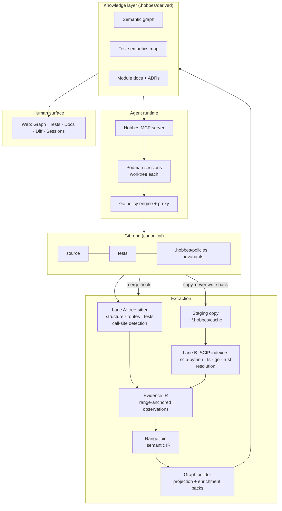

# Hobbes — Architecture

**This is the running architecture** (ADR-033). It describes Hobbes as it is
now, not as of a version, and it carries no version number for that reason.
When the design moves, this file moves with it *in the same commit* — the
rule is in §8 and it is what keeps the file true. It is the source-of-truth
context for build sessions: read it fully, alongside CLAUDE.md and the last
two BUILDLOG entries, before writing code.

The frozen record of where Hobbes started is
[`hobbes-architecture-v1.md`](hobbes-architecture-v1.md), and `docs/adr/` is
the dated account of every change since. Where either disagrees with this
file, **this file wins**.

*(Why running instead of versioned: v1 shipped M0–M8, then the "v2"
extraction rewrite was written down as its own document — and the design
moved out from under it within three milestones. The evidence IR of ADR-029
is not the shape v2 described, and the demotion of ADR-031 reverses an
instruction v2 gave in plain words. A versioned architecture doc is stale
the day after the next decision. One running file, amended in place, cannot
drift without someone noticing.)*

---

## What Hobbes is

**A multilingual, deterministic code graphing environment.** It ingests a
repo and derives from it a policy-governed environment where agents do
line-level work and humans review at the concept level.

Three properties carry the whole design, in this order of precedence:

- **Accurate.** This is the job. Everything else here is a means to it. A
  graph that is wrong is worse than no graph, because it is *believed* —
  and it is believed by an agent that cannot check it.
- **Deterministic.** The skeleton is built by parsers and indexers, never by
  a model. Same commit in, same artifacts out. Generative work sits on top
  of the deterministic layer and is pinned to it (P5); it is never mixed
  into it.
- **Honest.** Determinism only promises the same answer twice — not a true
  one. So Hobbes reaches the truth it can and then *states the shape of what
  it missed*: a tier on every edge (P6), a registered constraint for every
  concession (P8), and its providers' limits owned as its own (P9).

**Abstraction is the product; accuracy is the precondition.** Hobbes exists
so a human can stop reading diffs and start reading architecture. That trade
is only worth making if the abstraction is true — a confident summary
standing on a graph that quietly guessed costs more than the diff it
replaced.

### Where this is going

The graph is not the goal. The goal is **single-use agents under derived,
systematic context.**

A model's accuracy degrades as context grows and as tasks pile up in one
session. The answer is not a larger window; it is a smaller job. Hobbes
knows the repo's real structure, so it can derive — per task — the context
that task actually needs and the policy that task is actually permitted,
start one agent inside both, and let the agent end when the task does.
Context is then *scoped by the architecture* rather than assembled by a
prompt, and regenerated rather than accumulated.

This is what the sandbox and the policy engine are for, and why they sit
below the model rather than inside it (P4). A rule in a prompt is a request.
A command outside the policy is not refused — it is **absent**: no binary on
the path, no mount to write through, no route to the network. *If an agent
cannot execute a command in a space where it literally cannot, then it
literally cannot.* Enforcement that depends on the model's cooperation is
not enforcement.

Three of the four pieces exist. The graph makes the derivation possible
(§3), invariants make the result checkable (§5), and the policy engine and
sandbox already make it enforceable (§6). What is **not** built is the
derivation itself — policy and context generated *from* the architecture for
one task. It is not a milestone yet and nothing here should be designed in a
way that makes it harder to reach.

**Local, deliberately.** Hobbes runs on the box, against a repo on disk. It
is not a hosted product, an application to log into, or an IDE plugin (§9).

---

## 1. Design principles

- **P1 — The repo stays canonical; the environment is derived.** Everything in
  `.hobbes/derived/` is regenerable from a commit SHA. Nothing derived is
  hand-maintained.
- **P2 — One knowledge layer, two renderers.** The same artifacts serve the
  human UI and the agent MCP tools. Never build docs-for-humans and
  context-for-agents separately.
- **P3 — Provenance on every generated claim.** Narrative statements cite
  `file:line @ SHA`. Graph edges cite their source lane and evidence.
- **P4 — Policy is enforced below the model.** OS sandbox and tool proxy are
  load-bearing; prompt-level rules are advisory.
- **P5 — Deterministic first, generative second.** Parsers and indexers build
  the skeleton; agent sessions only write narrative on top of it.
- **P6 — Degrade visibly, never silently.** When a semantic indexer
  fails — broken build, unwired language — the graph still exists at syntactic
  confidence and says so. Staleness gets badges; uncertainty gets tiers.
- **P7 — Languages are configuration, not integrations.** Adding a
  language means an indexer config entry plus an optional enrichment pack.
  If it requires touching the graph builder's core, the design has failed.
- **P8 — Every concession is a registered constraint.** When Hobbes
  cannot recover information — a limit of static analysis, a deliberate
  filter, a deferred sharpening — the gap is entered in
  `docs/constraints.md` together with the place a user meets it. P6 covers
  the run that failed; P8 covers what was never knowable. A constraint
  whose only surfacing is a document is recorded as *unsurfaced*, because
  a confident artifact concealing a known gap costs more trust than one
  that fails loudly (ADR-030).
- **P9 — A provider's limits are Hobbes's limits.** Semantics come from
  third-party, language-specific indexers that Hobbes runs and does not
  wrap (§3.2). Every gap one of them has *against us* is written down and
  surfaced as **ours** — never disowned as the indexer's problem, never
  left as a silent hole in the graph. The user is not running
  `scip-python`; they are running Hobbes, and a missing edge is
  indistinguishable from an absent call either way (C-1). A provider limit
  registers exactly like any other concession under P8 and additionally
  names the provider and version that produced it, because its lifetime is
  the provider's rather than ours: C-6, C-9 and C-23 are all provider
  limits, and any of them may end on an upstream release (ADR-034).
- **P10 — A specific safety guarantee outranks a general safety system.**
  A general mechanism — degrade-on-failure, catch-and-continue,
  escalate-by-default, expire-to-deny — is a policy about the *unknown*
  case. A specific guarantee (never read `.tfstate`, never push) is a
  decision about a *known* one. Where they meet the specific one wins, and
  the general mechanism must be written so it **cannot** absorb it: it names
  what it will not handle and re-raises that first. Rank by importance ×
  coverage — the broader a mechanism's reach, the less it may decide on its
  own. Intent is not enough, because whoever widens the general mechanism is
  usually not thinking about the specific one: V2.M4's `except Exception`
  around packs swallowed the refusal guarding I-1 and turned a refused
  ingest into a successful one (ADR-036).

---

## 2. System overview



---

## 3. Extraction layer

### 3.1 Lane A — syntax (tree-sitter)
Fast, incremental, error-tolerant; runs on every commit and works on code that
doesn't compile. Produces: file/module structure and folder topology,
framework-declared interfaces readable syntactically (FastAPI/Flask decorators,
Express/Nest registrations), test inventory and structure, and *approximate*
module-level dependency edges.

Four providers: `pysource` (Python), `tssource` (TS/JS, via the ts-morph
helper), `gosource` (Go, V2.M5), and the HCL walk inside the Terraform pack.
Each answers the same question — where are the call sites, and what encloses
them — and none of them resolves anything.

Two things Go made explicit that the others had not (ADR-037). **A type
conversion is spelled exactly like a call**: `Decision(s)` and `Resolve(s)`
are the same node, and no indexer separates them either, so lane A drops
conversions using the one thing it knows and SCIP does not — which names
are types. And **a Go import names a package, not a file**, so lane A emits
no in-repo import edges for Go at all; the join raises them from what the
call actually reaches, which is precise instead of a guess between a
package's files.

**Lane A no longer *resolves* symbols; it still *detects* syntax (ADR-029).**
An earlier wording said resolution "moves entirely to lane B", which assumed
lane B could answer everything lane A could. It cannot answer *is this a
call*: SCIP occurrences carry a `syntax_kind` that would say so, and
scip-python populates it for none of them. So lane A owns call-site
detection, lane B owns resolution, and the answer that matters — a call
pointing where it actually goes — comes from joining them (§3.4).

**Lane A's resolver is demoted, not deleted (ADR-031).** It stops producing
edges and becomes the join's *fallback*, consulted only where the semantic
provider resolved nothing and stamped `syntactic` when it is. There is one
resolver of record and it is lane B; what remains beneath it is a labelled
floor, not a second opinion. Without it, a repo whose language has no
indexer — or a box without one installed — would hold no call graph at all,
which P6 forbids and P7 would make permanent. The cost is registered as
constraint **C-8**.

### 3.2 Lane B — semantics (SCIP indexers)
Per-language batch indexers emitting SCIP, the universal IR: `scip-python`
(built on Pyright), `scip-typescript`, `scip-go`, and rust-analyzer's native
`scip` output when Rust arrives. Hobbes writes no provider adapters — it runs
indexers and consumes their output. Precise symbols, definitions, references,
and cross-file edges. Slower than lane A; cached (§3.6).

The lanes are **parallel sources, not sequential stages**: semantic providers
parse independently and never consume tree-sitter ASTs.

**Running someone else's indexer is a trade, and P9 is the price.** Hobbes
gets real name resolution for a language it never has to understand, and in
exchange it inherits that indexer's blind spots and owns them in public. The
inherited limits so far are registered as C-6 (SCIP cannot say what a
reference syntactically *was*), C-9 (only four descriptor kinds become graph
symbols), and C-23 (TypeScript semantics need the target repo's dependency
tree installed). Each names its provider and version, because unlike our own
concessions these can end on an upstream release.

**Lane B never writes to the target repo.** Indexers want to run inside the
tree they index, so Hobbes stages a copy under `~/.hobbes/cache` and runs
them there (ADR-027's seven-clause contract). Authored source is copied;
a regenerable dependency tree is *symlinked*, because copy-preserving it
measured a 6.4% loss of semantic references (ADR-032). Two properties of
that link are asserted by test rather than assumed: indexing writes nothing
through it, and teardown unlinks it instead of recursing into the target
(C-22). The second is the mistake that would delete a user's `node_modules`.

### 3.3 Universal IR and node identity
SCIP is the universal IR every semantic provider emits, and SCIP symbol
monikers are globally unique. **They are not, however, the graph's node
IDs** — a correction to the plan, and the range join is why.

The plan was moniker-keyed nodes, with lane-A-only modules held in a
separate `scip:`-free namespace and upgraded in place once an indexer
landed. What shipped instead: **node ids remain lane A's deterministic
path-based ids** (`hobbes.extract.graph`, `driver.Proxy`, `env:HOME`,
`ext:react`), and monikers stay *inside* lane B as the key it resolves
against. Because the lanes meet on file:line ranges rather than on ids
(§3.4), lane B never has to invent an id for anything lane A already named,
so node identity does not churn when an indexer is added, removed, or
upgraded — which was the actual goal. The `scip:` namespace ADR-028
reserved for ids lane B would have to invent exists and is unused.

Consequences, stated honestly because the plan claimed more:

- **Stability is a decision, not a property (ADR-027).** A moniker's version
  field defaults to the git revision, so left alone every symbol re-keys on
  every commit — which would make `hobbes diff` report the whole repo as
  removed-and-re-added. `--project-version` is always pinned to a constant.
  The price is that monikers carry no real version (**C-10**).
- **Monikers reach the join only after descriptor filtering** — roughly 86%
  of SCIP definitions are parameters, locals and meta symbols the graph does
  not want (**C-9**).
- **Multi-repo merge is less prepared than v2 assumed.** The claim was that
  moniker-keyed nodes make a merge a graph union rather than a migration.
  With path-based ids that no longer follows: two repos can both hold
  `src/util`, and the merge would need a repo-scoping pass the current ids
  do not have. Nothing is lost that was ever built — but §9's "monikers
  prepare it" is weaker than it reads, and this is the note that says so.

### 3.4 Graph builder
Joins the lanes on file:line ranges — SCIP occurrences carry ranges, lane A
structures carry ranges — **before the graph is built**, through two IRs
(ADR-029): providers emit range-anchored observations into an *evidence IR*,
the join resolves them into a *semantic IR*, and the builder projects that
onto ids without resolving anything itself. Joining finished edges instead
cannot produce an edge that is a call *because* tree-sitter saw one and
points where it does *because* SCIP resolved it — that edge belongs to
neither lane alone. Every edge records:

- `type` — imports | call | http-call | db-read | db-write | queue | env-read |
  infra edge types from the Terraform pack
- `tier` — `semantic` (SCIP-proven) | `syntactic` (lane A) | `dynamic`
  (reserved for coverage traces; schema present, ingestion out of scope)
- `evidence` — file:line ranges + producing lane/pack

**The join is the only producer of symbol edges** — for every language, and
it runs *whether or not lane B does*. With no semantic input, every call
site falls to the fallback arm (§3.1) and the graph is stamped `syntactic`
throughout. There is deliberately **no second code path** for the degraded
case, so P6 holds by construction rather than by a branch nobody exercises;
the test suite runs with lane B disabled by default, which means the
degraded path is the one under test on every run.

**Lane-agreement self-test:** wherever both lanes can produce the same
module-level edge they must agree, and — sharper — wherever both resolved
the same call *site*, they must resolve it to the same place. It is a CI
check and a command (`hobbes lanes`, exit 1 on disagreement), which makes it
a free extractor-bug detector rather than a report nobody opens. Consumers
treat tier as trust: an invariant violation proven on semantic edges is a
finding; on syntactic edges it is a suspicion, and the reviewer flow says
which.

### 3.5 Enrichment packs
SCIP supplies symbols and references — not typed architectural edges. Packs are
a plugin surface symmetric with indexers: framework-aware passes that promote
raw edges to typed ones (`http-call`, `db-read`, `queue`, `env-read`) and add
domain joins. The Terraform cross-layer join (env var → resource →
security-group rule) is a pack. v1's framework knowledge (FastAPI/Flask,
Express/Nest) refactors into packs. Packs declare which tier their edges carry.

**Built at V2.M4 (ADR-035).** Four packs — `http-python` (FastAPI/Flask
decorator routes), `cli-python` (`[project.scripts]`), `http-ts`
(Express/Nest), `terraform` (the whole HCL layer and its joins) — and the
graph builder now contains no framework knowledge at all. All four declare
`syntactic`: each reads structure with no semantic provider behind it.

**Registered in code, activated by detection.** There is no `hobbes.yaml`.
A pack's `applies()` reads the repo — an import of `fastapi`, the presence
of a `.tf` file — the same way indexer config is derived rather than
authored (§3.7). `graph.json` carries a `packs` list naming what ran, so
the layer is attributable in the artifact.

**A pack is defined by removability**, and that is the property the suite
asserts per pack: dropping one removes exactly its own contribution and
nothing else, and putting it back reproduces the artifact byte-for-byte.
Nodes it *shares* with another producer survive its removal — an `env:VAR`
that Python also reads is not the Terraform pack's to take away.

**Packs degrade, except when they refuse.** A pack that raises is reported
in `extraction_errors` and the ingest continues (P6). The exception is
`PackRefusal`, which is re-raised: a pack declining input the user supplied
— a `.tfstate` handed to `--tf-plan` — is not a pass that broke, and
degrading it would turn a refusal into a warning printed beside the thing
it refused to do. That distinction is load-bearing; it guards I-1, and it is
**P10's worked example** — the general mechanism names what it will not
handle rather than trusting itself to be careful (ADR-036).

Known cost: **a pack cannot be disabled for a repo where it misfires**
(**C-25**). The `packs` list makes a wrong edge attributable, not
suppressible.

### 3.6 Incrementality
Caching, not cleverness: partial SCIP indexes cached by content hash and
merged; lane B runs debounced locally and per-PR in CI; lane A remains the
every-commit fast path. Full re-index is always available and always correct
(`P1`), the cache only makes it cheap.

### 3.7 Adding a language — the checklist
1. Register the **indexer** (resolution): command, version pin, and how its
   per-repo config is derived.
2. Register a **syntax provider** (detection): a lane A grammar that finds
   call sites with file, line, column and terminal name.
3. Optional: enrichment pack(s) for its frameworks.

Nothing else — no change to the graph builder, the join, the schema or the
packs. Rust is the intended proof.

**Step 2 was "optional" until V2.M5, and it was wrong (ADR-037).** The
correction is worth stating in full, because it is the cost of P7 and it
does not go away: **no SCIP indexer populates `syntax_kind`.**
`scip-python` leaves it unset for 0 of 8,575 occurrences and `scip-go` for
0 of 18,682 — two independent implementations, same omission, and the field
is optional in SCIP so a third is likely to match. That field is the one
that separates a call from a type annotation from a plain mention.

So a language with an indexer and no syntax provider gets definitions and
references and **no `calls` edges at all**: `who_calls` answers nothing and
test reach is empty, because reach is the closure over call edges. That is
not a less rich graph, it is a graph missing the relation the system exists
to answer.

**P7 survives, narrowed.** "Languages are configuration, not integrations"
still holds for the *builder* — Go added zero lines to it. What P7 cannot
promise is that a language is free: it costs one grammar walk, a bounded
mechanical job with four worked examples now (`pysource`, `tssource`,
`gosource`, and HCL's). The claim that was wrong is "an indexer entry plus
an optional pack"; the claim that survives is "nothing in the core changes".

**Where steps 1 and 2 actually live.** `hobbes.yaml` does not exist and is
not going to — the architecture named it before anything needed it, and
both registries landed narrower and derived.

The indexer *registry* is `INDEXERS` in `scip/index.mjs`, keyed by language,
holding the binary and its argv. The per-repo *config* is **derived, not
authored** (ADR-027 amendment): stage path, TS zone, declared dependencies
and the pinned project version are computed at ingest by
`extract/scipsource.py`, because every one is a fact about the repo Hobbes
can already see, and asking a human to restate it is an invitation to state
it wrong.

The pack registry is the same shape and for the same reason (ADR-035): a
tuple in `hobbes/extract/packs/__init__.py`, with each pack detecting its
own applicability from the repo. **The ADR-012 tension dissolved rather
than being resolved** — nothing is authored, so nothing needs to be tracked
or gitignored, and a fresh clone gets the same packs as the machine that
ingested last. It returns the day someone needs a pack *disabled* for one
repo (C-25), and that file will have to live somewhere that survives a
clone.

---

## 4. Knowledge layer

- **Semantic graph** — nodes keyed by lane A's path-based ids (§3.3); typed,
  tiered edges; rendered as C4-style levels (symbol-level stored,
  module-level rendered, expand on demand — Cytoscape.js in the web surface,
  Mermaid for exports). **Graph diffs** stay the review primitive and are
  tier-aware: a PR's architecture delta distinguishes proven new edges from
  suspected ones.
- **Test semantics map** — behavioral one-liners per test, forward and inverse
  test↔code indexes, behavioral coverage vs stated invariants, weak-test
  heuristics. Reach is per test *case* in every supported language since
  V2.M3, and is derived from the join's symbol edges rather than from lane A
  guesses. Unchanged in purpose.
- **Docs** — SHA-pinned module docs and system narratives written by
  cartographer sessions over the deterministic skeleton; ADRs remain the one
  hand-authored class. Stale badges on SHA drift; the periodic auditor session
  spot-checks claims against cited lines.

---

## 5. Invariants

Constrained YAML schema, one record per invariant, with a checking mode
(**built at V2.M6**, ADR-039):

```yaml
id: I-3
statement: only auth.core may mint or validate tokens
scope: src/
status: confirmed            # inferred | confirmed | retired
check: graph                 # graph | emit | soft
rule:                        # required for graph and emit; forbidden for soft
  kind: forbidden-import     # forbidden-import | pattern-absent | resource-attribute
  importers: ["*"]
  except: [auth.core]
  imported: [auth.token]
compile:                     # only when check: emit
  target: import-linter      # import-linter | dep-cruiser | semgrep | rego
guarded_by: [test_token_boundary]
```

- `check: graph` — the **unified checker** evaluates the invariant directly
  against the semantic graph, using semantic-tier edges as proof and flagging
  syntactic-tier matches as suspicions (`suspect`, sorted between `fail` and
  `unknown`; both exit 1) — except on edges only lane A can produce at all
  (`ext:`/`env:`/`tf:` targets, §3.1), where the syntactic form is the
  authoritative one and counts as proof. Validation refuses a `check: graph`
  record whose kind the graph cannot answer — it would sit at `unknown`
  forever, a check that cannot check. This is the v2 direction: one checker,
  every language, no per-language fragmentation.
- `check: emit` — compile to per-language tools (import-linter,
  dependency-cruiser, semgrep; Rego/Conftest against `terraform plan -json`).
  Retained as the CI-compatibility escape hatch and for teams' existing
  toolchains. The unified checker still answers in-process wherever the graph
  can see the rule, so the emitted tool always has a verdict to agree with.
- `check: soft` — reviewer session evaluates and must cite evidence.

---

## 6. Carried subsystems (v1, condensed)

- **Policy engine (Go, single implementation)** — box → repo → folder merge,
  deny-overrides-allow, `allow | deny | escalate`; used by CLI and daemon.
- **Sandbox** — Podman rootless, image per role (implementer rw-worktree;
  reviewer read-only; cartographer read-source + rw-derived); policy paths map
  to mounts, network policy to container config. Secrets brokered per-command
  at the proxy (ajax-manager pattern); never in session env. `.tfstate` denied
  at box level; `derived/` never committed.
- **Escalation** — parked sessions, Sessions-tab cards, expire-to-deny
  (default 30 min), logged approvals.
- **Flight recorder** — append-only JSONL per session:
  `{ts, session, role, tool, argv, policy_rule, decision, exit, sha}`.
- **Quota** — per-session caps plus box-level reserve gating the spawner.
- **Human surface** — Graph · Tests · Docs · Diff · Sessions · Intent;
  loopback-only, enforced at bind and per-request `Host` (ADR-022);
  concept-review flow: graph diff → invariant verdicts → behavioral coverage
  delta → line diff last. Edge styling by tier is **built**. The
  lane-disagreement view is **not** — `hobbes lanes` is a command and a CI
  check with no tab behind it, which is a known gap awaiting scope, not an
  oversight.

Rejected alternatives, for the record: live LSP querying (stateful, slow for
whole-repo batch; may return later for UI hover only), stack graphs (thin
language coverage), Kythe (operationally heavy). SCIP indexers are the
maintained middle.

---

## 7. Build programme — status

The file-level plan, exit criteria, estimates and the reasoning behind every
deviation live in **[`hobbes-build-plan-v2.md`](hobbes-build-plan-v2.md)**;
this section holds only the state, because a milestone plan restated in two
places is a plan that disagrees with itself. Language mapping is unchanged:
Python for pipeline and packs, Go for engine/proxy/supervisor, TS for web.

**v1 (M0–M8) is complete and reviewed** — policy engine, extractors,
Mermaid/diff, Terraform layer, proxy + sandbox + flight recorder, narrative
pass, TS extraction, web surface, reviewer flow + invariant compiler. It is
recorded in [`hobbes-build-plan.md`](hobbes-build-plan.md) and
[`hobbes-architecture-v1.md`](hobbes-architecture-v1.md).

The v2 extraction programme:

| Milestone | State | What it settled |
|---|---|---|
| **V2.M0** — SCIP spike | done | ADR-027: monikers usable, under three conditions that are all silent when wrong |
| **V2.M1** — schema v4 + version gate | done | ADR-028: tiers and lanes, additive over v3; three consumers refuse rather than half-read |
| **V2.M2** — lane B (Python) | done | ADR-029: two providers meeting in an evidence IR, not two edge sets merged |
| **V2.M3** — lane A demotion, TS lane, self-test | done, **reviewed 2026-08-15** | ADR-030 (P8), ADR-031 (demote, don't delete), ADR-032 (stage and symlink); discharges M2's asterisk |
| **V2.M4** — enrichment packs | done | ADR-035: registered in code, activated by detection — no `hobbes.yaml`, and the ADR-012 tension dissolves |
| **V2.M5** — Go support | done | ADR-037: the checklist needed a third mandatory step. Hobbes now sees its own Go — 216 nodes, 5 languages |
| **V2.M6** — unified invariant checker | built, awaiting review | ADR-039: `check: graph|emit|soft`, tier-aware verdicts with the lane-A-only carve-out; lint-imports executed for the first time and found an emitter bug; soft verdicts source-based (C-18 lifted) |
| **V2.M7** — Rust proof | not started | P7 demonstrated on a language nobody planned for |

Sequencing rules carry from v1 unchanged: deterministic before generative,
each milestone exits on a real repo, **one milestone active at a time**, and
exits stop for human review rather than rolling on.

---

## 8. Using this document in build sessions

Session context = this file + CLAUDE.md + the last two BUILDLOG entries.

**This file is running, and staying that way is a rule, not an aspiration**
(ADR-033). A change that moves the architecture patches this document *in
the same commit as the code*, and an ADR that amends it names the section it
amends. A session that finds this file describing something the tree does
not do has found a bug in the file — fix it, and say so in the BUILDLOG,
rather than working around it. §3.3 is the worked example: it claimed
moniker-keyed node ids for three milestones after the range join made them
unnecessary.

The rest of the standing discipline is unchanged: plan file-by-file before
implementing; an ADR for every decision this document doesn't make; **a
`C-n` entry in `docs/constraints.md` for every decision that concedes
information (P8, ADR-030), naming the provider when the concession is
inherited (P9, ADR-034)**; BUILDLOG entry and CLAUDE.md status update every
session; tests with the code they test; conventional commits; never read
`.tfstate`, never commit `derived/`, never `git push`. Milestone exits stop
and hand the wheel to the human — spot-checks and walkthroughs are theirs to
run.

## 9. Out of scope

Deliberately not built, and not deferred-with-intent unless said so:

- **Hosted anything.** Hobbes is local, runs on the box, and reads a repo on
  disk. No server-side product, no login, no multi-user surface. The web
  surface is loopback-only and enforced at bind (ADR-022), and that is a
  design position, not a stage on the way to hosting.
- **Hobbes-as-an-application** — a workspace-model desktop app that opens
  folders. Assessed in `m9-application-mode.md` and **parked**: kept as a
  record of the thought, not on the roadmap, and not to be started. It would
  cross ADR-022's "the surface never runs the pipeline" line.
- **IDE plugins**; any model fine-tuning; live LSP for UI hover.
- **Multi-repo graphs** — see §3.3 for why the preparation is thinner than
  originally claimed.
- **Dynamic-tier ingestion** — the schema reserves `dynamic` for coverage
  traces; nothing produces it.
- **Languages beyond Python/TS/Go plus the Rust proof.**
